# Development of Electrochemical Sensor for Cefadroxil Antibiotic Based on Conductive Carbon Black Decorated with Tetrabutylammonium Tetrafluoroborate

ZHU Zongxian $^{1}$ , ZHANG Xuan $^{1,2*}$

1. Key Laboratory of Science and Technology of Eco-Textiles, Ministry of Education, College of Chemistry and Chemical Engineering, Donghua University, Shanghai 201620, China  
2. National Innovation Center of Advanced Dyeing & Finishing Technology, Tai'an 271000, China

Abstract: The development of analytical methods for antibiotic detection has become crucial for public health. In this research, a novel and simple electrochemical sensor for sensitive detection of cefadroxil (CFL) antibiotic was developed. The glassy carbon electrode (GCE) was coated with cheap conductive carbon black VXC-72R that was decorated with tetrabutylammonium tetrafluoroborate  $\left(\mathrm{TBABF}_{4}\right)$ , to construct the electrochemical sensor  $\mathrm{TBABF}_{4} / \mathrm{VXC}-72\mathrm{R} / \mathrm{GCE}$ . It was found that CFL exhibited a reduction peak at approximately  $0.22\mathrm{~V}$  on  $\mathrm{TBABF}_{4} / \mathrm{VXC}-72\mathrm{R} / \mathrm{GCE}$ .  $\mathrm{TBABF}_{4} / \mathrm{VXC}-72\mathrm{R} / \mathrm{GCE}$  showed a linear response to CFL in a concentration range of  $0.3-10.0\mu\mathrm{mol/L}$ , with a detection limit of  $0.2\mu\mathrm{mol/L}$  (a signal-to-noise ratio of 3).  $\mathrm{TBABF}_{4} / \mathrm{VXC}-72\mathrm{R} / \mathrm{GCE}$  showed good reproducibility, high storage stability and anti-interference performance. Analytical applications for CFL detection in real lake water, pharmaceutical tablet and fetal bovine serum samples were achieved.

Keywords: electrochemical sensor; conductive carbon black; tetrabutylammonium tetrafluoroborate (TBABF $_4$ ); cefadroxil (CFL) antibiotic

CLC number: O652

Document code: A

Article ID: 1672-5220(2025)04-0348-10

Open Science Identity (OSID)

# 0 Introduction

The wide use of antibiotics has opened a window to defeat infectious diseases, but subsequent environmental pollution and bacterial resistance problems have become more and more serious[1-2]. Cefadroxil (CFL), a broad-spectrum  $\beta$ -lactam-like antibiotic, has been mostly used for the clinical treatment of bacterial infections[3]. In this regard, it is highly essential to develop sensitive, rapid and simple detection methods for CFL antibiotic.

Many analytical methods, such as spectrophotometry[4], chromatography[5] and capillary

electrophoresis[6] have been reported to detect CFL. However, these traditional methods often require expensive instruments and complicated sample pretreatment. Electrochemical sensors have been widely studied and applied in environmental protection, biomedicine and food safety due to their advantages of simplicity, low cost, high sensitivity and rapidity[7-8]. Several electrochemical sensors have been reported for CFL detection based on various electrodes[9-10]. These sensors have shown potential applications for CFL detection in real pharmaceutical tablet and serum samples.

As one of the typical carbon nanomaterials, conductive carbon black has been widely used as a versatile electrode material in the fabrication of electrochemical sensors, due to its characteristics of low price, excellent conductivity and large specific surface area[11-13]. To decrease the aggregation tendency of carbon black and enhance the stability on the electrode surface, chitosan is usually used to efficiently disperse and immobilize carbon black without noticeable effect on electron transfer[14]. In addition, electrolytes such as ionic liquids have been reported to be promising additives that could substantially improve the sensitivity of electrochemical sensors[14-17].

In this research, three electrolytes, 1-butyl-3-methylimidazole tetrafluoroborate (BMIMBF $_4$ ), tetrabutylammonium tetrafluoroborate (TBABF $_4$ ) and tetrabutylammonium bromide (TBABr), were employed to decorate the conductive carbon black VXC-72R, and further immobilized by chitosan on the glassy carbon electrode (GCE) surface to fabricate novel electrochemical sensors for CFL. Interestingly, TBABF $_4$ /VXC-72R/GCE showed the highest sensitivity, reflecting that the optimized interfacial affinity of electrolytes might play a substantial role in sensing performance. TBABF $_4$ /VXC-72R/GCE was also successfully used to determine CFL in lake

water, pharmaceutical tablet and fetal bovine serum samples.

# 1 Materials and Methods

# 1.1 Reagents and materials

VXC-72R was supplied by Cabot Corporation, USA.  $\mathrm{TBABF}_4$ , TBABr, potassium ferricyanide  $(\mathrm{K}_3[\mathrm{Fe}(\mathrm{CN})_6])$ , chitosan and absolute ethanol were purchased from Sinopharm Chemical Reagent Corporation, China.  $\mathrm{BMIMBF}_4$  was purchased from Accela ChemBio Co., Ltd., China. Glacial acetic acid, nitric acid and potassium chloride were purchased from Shanghai Macklin Biochemical Co., Ltd., China, Aladdin Reagent Co., Ltd., China and Shanghai Titan Scientific Co., Ltd., China, respectively. CFL was purchased from Rhawn Chemical Reagent Corporation, China. All chemicals are of analytical grade unless otherwise specified.

# 1.2 Instruments

All electrochemical data were recorded on the electrochemical workstation ( CHI-760E, Chenhua, Shanghai, China), and three electrode systems consisting of GCE (a diameter of  $3\mathrm{mm}$ ), saturated calomel electrode (SCE) and platinum wire electrode were employed. The hydrophilicity of electrode materials was characterized by a contact angle analyzer (KRUSS DSA 255, Germany). The scanning electron microscopy (SEM) images were obtained with a scanning electron microscope ( Hitachi Regulus 8230, Japan) and were used to characterize the surface morphology of the materials. Fourier transform infrared ( FTIR ) spectra were obtained with an FTIR spectrometer ( NEXUS-670,

Thermo Nicolet, USA). The dispersion of catalyst materials and pH measurement of phosphorate buffer solution (PBS) were performed on an ultrasonic cleaner (KQ3200, Kunshan Ultrasonic Instruments, Jiangsu, China) and a pH meter (FE28-Standard, METTLER TOLEDO Shanghai, China), respectively.

# 1.3 Construction of electrochemical sensors

Firstly, VXC-72R and  $\mathrm{TBABF}_4$  were added to a chitosan solution (CS) (mass fraction of  $0.1\%$  and prepared in acetic acid solution) at VXC-72R:  $\mathrm{TBABF}_4$  mass ratios of 1:1, 1:2, 1:3 and 1:4, with the final mass concentration of VXC-72R fixed at  $2\mathrm{mg/mL}$ . In order to make them evenly dispersed, the mixed materials were sonicated for  $30\mathrm{min}$  to obtain  $\mathrm{TBABF}_4/\mathrm{VXC}-72\mathrm{R}$  dispersion. Other electrode materials such as  $\mathrm{BMIMBF}_4/$  VXC-72R, TBABr/VXC-72R and VXC-72R were prepared according to similar procedures.

Then the surface of the bare GCE was pre-treated as described in Refs. [18-19]. In brief, it was polished to a mirror surface with  $0.05\mu \mathrm{m}$  alumina powder and thoroughly rinsed with deionized water. The electrodes were then sequentially sonicated in nitric acid solution (nitric acid and deionized water mixed at a volume ratio of 1:1), absolute ethanol and deionized water.  $\mathrm{TBABF_4 / VXC - 72R / GCE}$  was fabricated by dropping  $9\mu \mathrm{L}$  of the above  $\mathrm{TBABF_4 / VXC - 72R}$  dispersion on the cleaned GCE and drying at  $50~^\circ \mathrm{C}$ .  $\mathrm{BMIMBF_4 / VXC - }$  72R/GCE, TBABr/VXC-72R/GCE and VXC-72R/GCE were fabricated following the same procedure. The fabrication of  $\mathrm{TBABF_4 / VXC - 72R / GCE}$  and application for CFL detection are shown in Scheme 1.

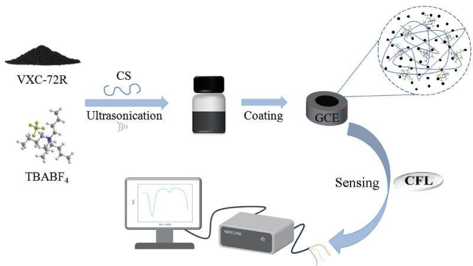  
Scheme 1 Fabrication of  $\mathrm{TBABF}_4 / \mathrm{VXC - }72\mathrm{R} / \mathrm{GCE}$  and application for CFL detection

# 1.4 Electrochemical test of CFL

The electrochemical reduction of CFL was studied by differential pulsed voltammetry (DPV) on GCE, VX-72R/GCE, TBABF $_4$ /VXC-72R/GCE, TBABr/VXC-72R/GCE and BMIMBF $_4$ /VXC-72R/GCE in PBS solution  $(0.1 \, \text{mol/L}, \, \text{pH} = 4)$ , respectively. The conductivity of different electrodes was assessed by electrochemical impedance spectroscopy (EIS) in

0.1 mol/L KCl solution containing 5 mmol/L  $\mathrm{K}_3[\mathrm{Fe}(\mathrm{CN})_6]$  with a scanning voltage of  $0.22\mathrm{V}$  and a frequency range of  $0.01 - 100000\mathrm{Hz}$ . The redox behaviors of CFL on  $\mathrm{TBABF}_4 / \mathrm{VXC - }72\mathrm{R} / \mathrm{GCE}$  were characterized by cyclic voltammetry (CV).

# 1.5 Real sample processing

The CFL tablets were purchased from local pharmacies. Five commercial CFL tablets (CSPC Ouyi,

Hebei, China) were ground into powder, and  $46.3\mathrm{mg}$  was taken and dissolved in deionized water  $(20~\mathrm{mL})$  under ultrasonication for  $30\mathrm{min}$ . The supernatant was filtered, and the precipitate was washed three times with deionized water. The obtained solution was collected and diluted in a  $100~\mathrm{mL}$  volumetric flask as a stock solution. The sample stock solution was stored at  $4^{\circ}\mathrm{C}$  in a refrigerator and further diluted 1000-fold for testing.

The lake water sample was obtained from Jingyue Lake (Songjiang Campus, Donghua University, Shanghai, China). It was filtered three times to remove insoluble impurities. The sample stock solution was stored at  $4^{\circ}\mathrm{C}$ . It was diluted 20-fold with  $0.1\mathrm{mol/L}$  PBS for testing. The fetal bovine serum sample was purchased from Corning Life Sciences (Shanghai,

China) and directly diluted 25-fold with  $0.1\mathrm{mol} / \mathrm{L}$  PBS for testing.

# 2 Results and Discussion

# 2.1 Electrode material characterization

SEM images of VXC-72R,  $\mathrm{TBABF}_4 / \mathrm{VXC - 72R}$ , TBABr/VXC-72R and BMIMBF $_4$ VXC-72R are shown in Fig.1. It can be seen that VXC-72R particles disperse well on the electrode surface due to the presence of chitosan (Fig.1(a)). Interestingly, more continuous and denser film morphologies are observed with the electrolytes  $\mathrm{TBABF}_4$ , TBABr and  $\mathrm{BMIMBF}_4$  decoration of VXC-72R (Figs. 1(b)–1(d)).

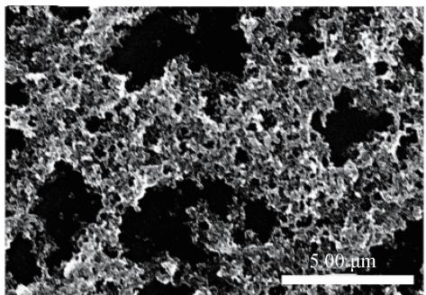  
(a)

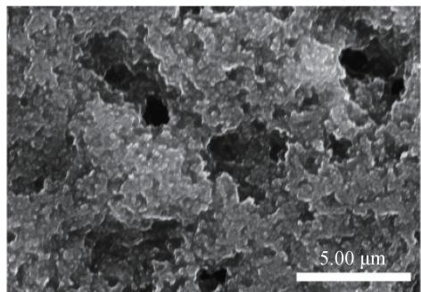  
(b)

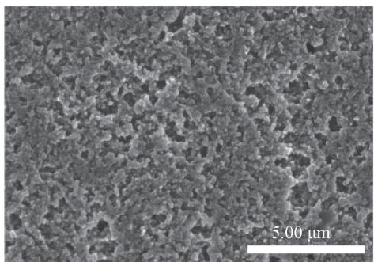  
(c)

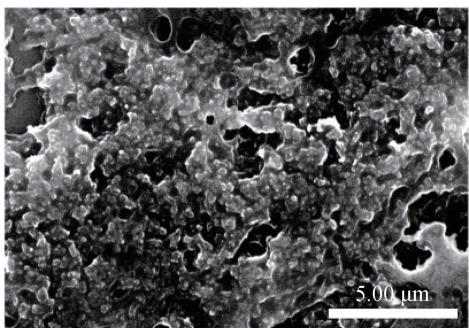  
(d)  
Fig.1 SEM images: (a) VXC-72R; (b) TBABF $_4$  /VXC-72R; (c) TBABr /VXC-72R; (d) BMIMBF $_4$  /VXC-72R

FTIR spectra of VXC-72R,  $\mathrm{TBABF_4 / VXC - 72R}$  TBABr/VXC-72R and  $\mathrm{BMIMBF}_4 / \mathrm{VXC - 72R}$  are shown in Fig. 2. Compared to bare VXC-72R, all decorated materials show characteristic peaks of electrolytes, respectively.  $\mathrm{TBABF_4 / VXC - 72R}$  exhibits the typical absorption peaks at 1049 and  $1152~\mathrm{cm}^{-1}$ , corresponding to the stretching vibrations of B-F and C-N, respectively[20]. The absorption peaks at 2877 and  $2960~\mathrm{cm}^{-1}$  could be assigned to the C-H stretching vibrations of methyl and methylene, while the bands at 1284, 1381 and

$1486~\mathrm{cm}^{-1}$  correspond to ammonium ion of tetrabutylammonium (TBA) groups[16]. Similarly, TBABr/VXC-72R also shows characteristic peaks from TBA groups. In addition,  $\mathrm{BMIMBF}_4 / \mathrm{VXC - 72R}$  shows the characteristic peaks:  $C = N$ $(1567~\mathrm{cm}^{-1})$  , C-N stretching vibration  $(1165~\mathrm{cm}^{-1})$  , and C-H stretching vibration of 1-butyl-3-methylimidazolium cation (3 111 and  $3167~\mathrm{cm}^{-1})^{[20]}$  . The occurrence of these characteristic peaks proves that  $\mathrm{TBABF_4}$  , TBABr, and  $\mathrm{BMIMBF}_4$  have been successfully decorated on VXC-72R, respectively.

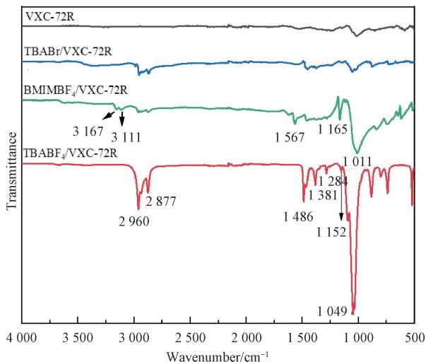  
Fig.2 FTIR spectra of VXC-72R,  $\mathrm{TBABF}_4 / \mathrm{VXC - 72R}$  TBABr/VXC- 72R and BMIMBF  $^4 /$  VXC-72R

Water contact angles on different electrode surfaces were measured to evaluate the hydrophilicity of the electrode materials. The results are shown in Fig. 3. It can be seen that the average contact angle on the bare GCE is  $84.5^{\circ}$  and decreases on the decorated electrodes by following the order of VXC-72R/GCE  $(79.2^{\circ})$ , TBABF $_4$ /VXC-72R/GCE  $(68.2^{\circ})$ , TBABr/VXC-72R/GCE  $(65.3^{\circ})$  and BMIMBF $_4$ /VXC-72R/GCE  $(64.6^{\circ})$ . The hydrophilicity of the GCE surface is substantially enhanced with the introduction of electrolytes. Notably, the surface of TBABF $_4$ /VXC-72R/GCE shows the largest contact angle among electrolyte-decorated electrodes, implying a more hydrophobic nature of TBABF $_4$  than those of TBABr and BMIMBF $_4$ . This may be rationalized by considering the fact that  $\mathrm{TBA}^{+}$ and  $\mathrm{BF}_4^{-}$ are more hydrophobic than  $\mathrm{BMIM}^{+}$ and  $\mathrm{Br}^{-[21]}$ .

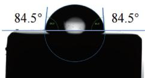  
(a)

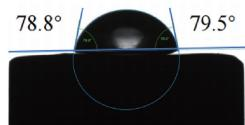  
(b)

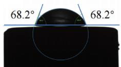  
(c)  
Fig.3 Water contact angles on different electrode surfaces: (a) GCE; (b) VXC-72R/GCE; (c) TBABF $_4$ /VXC-72R/GCE; (d) TBABr/VXC-72R/GCE; (e) BMIMBF $_4$ /VXC-72R/GCE

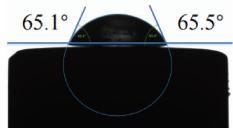  
(d)

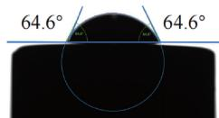  
(e)

# 2.2 Electrochemical characterization of different electrodes

The EIS plots and CV curves of GCE, VXC-72R/ GCE, TBABF $_4$ /VXC-72R/GCE, TBABr/VXC-72R/ GCE and BMIMBF $_4$ /VXC-72R/GCE are shown in Fig. 4. As shown in Fig. 4(a), the EIS plots are obtained in  $0.1 \, \text{mol/L}$  KCl solution containing  $5.0 \, \text{mmol/L}$ $\mathrm{K}_3[\mathrm{Fe}(\mathrm{CN})_6]$ . From the enlarged plots between

0-1 000  $\Omega$  (inset in Fig. 4(a)), the bare GCE shows the largest diameter of the semicircle in the high-frequency region, indicating the greater charge transfer resistance  $R_{\mathrm{ct}}$ . However,  $R_{\mathrm{ct}}$  is greatly reduced when GCE is decorated with VXC-72R, TBABF $_4$ /VXC-72R, BMIMBF $_4$ /VXC-72R or TBABr/VXC-72R, indicating the excellent electronic conductivity of these electrode materials.

(a)  
Fig. 4 Electrochemical characterization of different electrodes: (a) EIS plots; (b) CV curves  
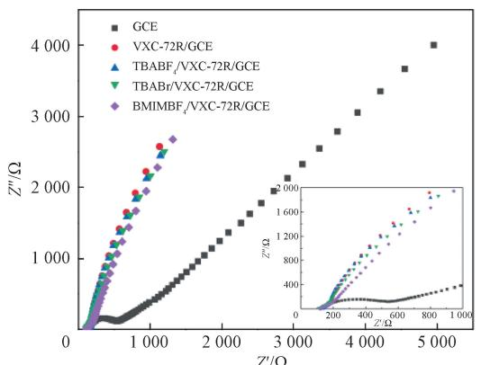  
$Z^{\prime}$  real part of impedance;  $Z''$  imaginary part of impedance;  $E$  potential;  $I$  current.

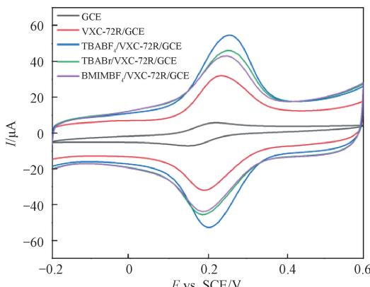  
(b)

Figure 4 (b) shows the CV curves of the  $\mathrm{K}_3[\mathrm{Fe}(\mathrm{CN})_6]$  probe in  $0.1\mathrm{mol / L}$  PBS solution  $(\mathrm{pH} = 7)$  on different electrodes. Compared to the bare GCE, the redox current on VXC-72R/GCE is significantly enhanced, revealing the high conductivity of carbon black. Notably, the current is further enhanced with the addition of TBABF4, TBABr and BMIMBF4, respectively, which may result from the improved dispersion of VXC-72R as observed in Fig. 1, as well as the high conductivity of electrolytes. The electrochemically active surface areas (ECSAs) are estimated according to the Randles-Sevcik equation, and the values are 0.07, 0.41, 0.73, 0.62 and  $0.57~\mathrm{cm}^2$  for GCE, VXC-72R/GCE, TBABF4/VXC-72R/GCE, TBABr/VXC-72R/GCE and BMIMBF4/VXC-72R/GCE, respectively.

# 2.3 Electrochemical behavior of CFL

Figure 5 shows the CV curve of CFL  $(50.0\mu \mathrm{mol} / \mathrm{L})$  on  $\mathrm{TBABF}_4 / \mathrm{VXC - }72\mathrm{R} / \mathrm{GCE}$  in  $0.1\mathrm{mol} / \mathrm{L}$  PBS  $(\mathrm{pH} = 4)$ . It displays one anodic peak 1a and two cathodic peaks  $2c^{\prime}$  and  $2c$  at the first scan, respectively. At the second scan, two new anodic peaks 2a and  $2a^{\prime}$  appear, where a well-defined reversible redox pair  $2c / 2a$  is produced with potential difference  $\Delta E = 40~\mathrm{mV}$  and  $I_{\mathrm{pa}} / I_{\mathrm{pc}} = 0.87$ .  $I_{\mathrm{pa}}$  and  $I_{\mathrm{pc}}$  are the oxidation peak current and the reduction peak current, respectively. Peak 1a is assigned to the oxidation of the phenol moiety in CFL, forming a phenoxy radical. This radical subsequently undergoes chemical hydrolysis to generate a catechol moiety, which then participates in a reversible redox reaction, corresponding to peaks  $2\mathrm{a} / 2\mathrm{c}^{[22 - 23]}$ . In addition, peaks  $2\mathrm{a}^{\prime}$  and  $2c^{\prime}$  could be attributed to resorcinol and dimeric species produced from the chemical steps of radicals[23-24]. In this work, the reversible peaks  $2\mathrm{a} / 2\mathrm{c}$  were then selected for the quantitative detection of CFL.

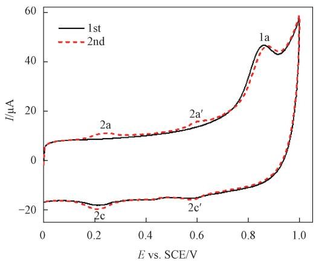  
Fig.5 CV curve of CFL in  $0.1\mathrm{mol / L}$  PBS  $(\mathrm{pH} = 4)$

Then in the presence of  $50.0~\mu \mathrm{mol / L}$  CFL in  $0.1\mathrm{mol / L}$  PBS  $(\mathrm{pH} = 4)$ , DPV measurements were performed on GCE, VXC-72R/GCE,  $\mathrm{TBABF_4 / VXC - }$  72R/GCE, TBABr/VXC-72R/GCE and BMIMBF/ VXC-72R/GCE, respectively (Fig. 6). As shown in

Fig. 6 (a), the current around  $0.22\mathrm{V}$  significantly increases after decoration with VXC-72R. As can be seen in Fig. 6 (b), the peak current  $I_{\mathrm{p}}$  increases to approximately 1.9, 1.5 and 1.4 times upon introduction of  $\mathrm{TBABF}_4$ , TBABr and BMIMBF, respectively. This reveals that the decoration of VXC-72R with electrolytes substantially enhances the sensitivity of the electrochemical sensor. The greatest enhancement of  $\mathrm{TBABF}_4 / \mathrm{VXC - 72R / GCE}$  could be attributed to its larger electrochemically active area (Fig. 4(b)), as well as optimized interfacial affinity toward CFL sensing.

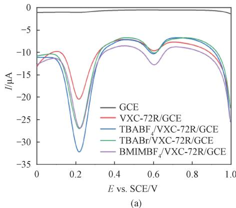

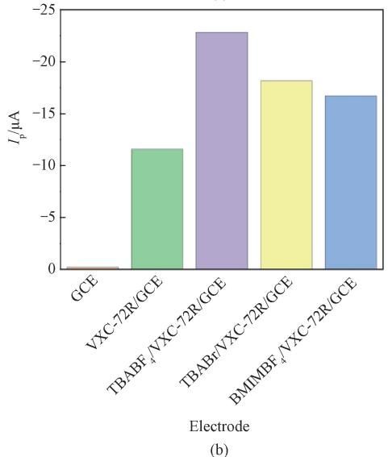  
Fig.6 DPV measurements of CFL on different electrodes: (a) current vs. potential; (b) peak current at the potential of  $0.22\mathrm{V}$

# 2.3.1 Optimization of detection condition

In order to obtain high sensitivity, the experimental conditions for CFL (50.0  $\mu$ mol/L) detection were optimized by the DPV method. Figure 7(a) shows the effect of different mass ratios of TBABF $_4$  to VXC-72R ( $m_{\mathrm{TBABF}_4}: m_{\mathrm{VXC-72R}}$ ) on the detection of CFL. When the mass ratio ranges from 1:1 to 2:1, the peak current increases; further increasing the mass ratio, the peak current remains almost constant (Fig. 7(b)). Thus, the mass ratio of TBABF $_4$  to VXC-72R is selected to be

2:1. DPV measurements of CFL on  $\mathrm{TBABF}_4 / \mathrm{VXC}-72\mathrm{R} / \mathrm{GCE}$  at different pH values are shown in Fig. 7(c). It can be seen that as the pH value increases, the peak potential continues to shift negatively, indicating that the protons participate in the electrochemical reaction process. At the same time, the peak current reaches the maximum value at  $\mathrm{pH} = 4$  (Fig. 7(d)) and thus 4 is selected as the optimal pH value for the following experiments. Figure 7(e) shows the effects of different accumulation times on the detection of CFL by  $\mathrm{TBABF}_4 / \mathrm{VXC}-72\mathrm{R} / \mathrm{GCE}$ . The peak current remains almost constant when the accumulation time increases from 0 to

2 min, and decreases significantly after 2 min (Fig. 7(f)). Therefore, 1 min is selected as the optimal accumulation time. The DPV curves of different volumes of  $\mathrm{TBABF}_4/$  VXC-72R (  $2\mathrm{mg / mL}$  ) decorated GCE for the determination of CFL are exhibited in Fig. 7(g). As the volume of  $\mathrm{TBABF}_4/$  VXC-72R increases, the peak current increases and reaches a maximum at a volume of  $9\mu \mathrm{L}$  (Fig. 7(h)). As the volume of  $\mathrm{TBABF}_4/$  VXC-72R continues to increase, the peak current decreases, which may be due to excess  $\mathrm{TBABF}_4/$  VXC-72R hindering electron transfer. Therefore, the optimal  $\mathrm{TBABF}_4/$  VXC-72R volume for the detection of CFL is  $9\mu \mathrm{L}$ .

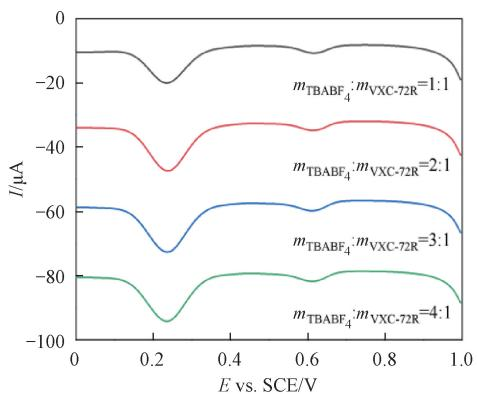  
(a)

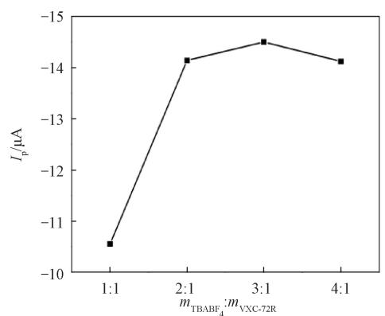  
(b)

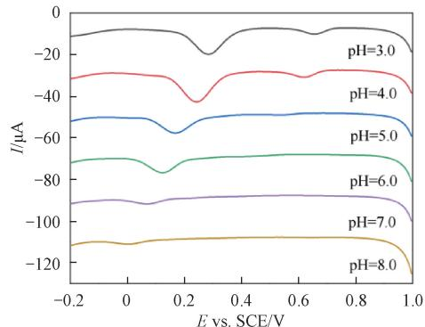  
(c)

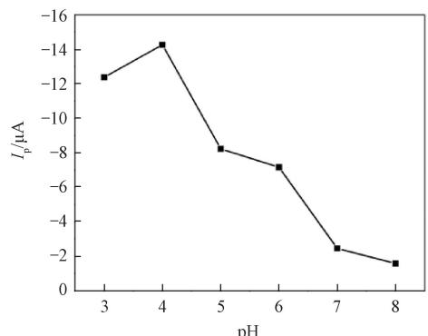  
(d)

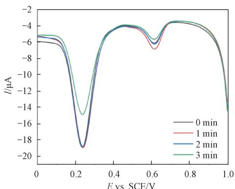  
(e)

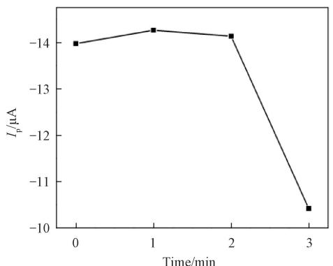  
(f)

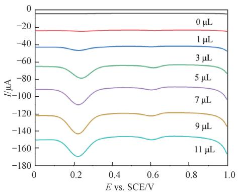  
(g)

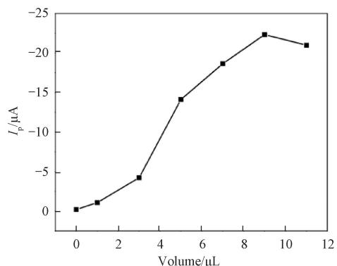  
(h)  
Fig. 7 DPV measurements of CFL on  $\mathrm{TBABF}_4 / \mathrm{VXC - 72R / GCE}$  and corresponding peak currents under different conditions: (a)-(b) mass ratio of  $\mathrm{TBABF}_4$  to VXC-72R; (c)-(d) pH value; (e)-(f) accumulation time; (g)-(h) volume of  $\mathrm{TBABF}_4 / \mathrm{VXC - 72R}$

# 2.3.2 Effect of scanning rate

The CV curves of CFL (50.0  $\mu$ mol/L) on TBABF $_4$ /VXC-72R/GCE at various scanning rates (20–200 mV/s) are shown in Fig. 8(a). The intensity of the redox peak current increases with the increasing scanning rate, accompanied by the positive and negative shifts of the oxidation and reduction peak potentials, respectively. Moreover, the peak currents of CFL have good linear relationships with the scanning rates (Fig. 8(b)), and

the linear equations are  $I_{\mathrm{pa}} = 0.5364\nu + 3.1348$  ( $R_{\mathrm{pa}}^2 = 0.9990$ ) and  $I_{\mathrm{pc}} = -0.5364\nu - 4.4887$  ( $R_{\mathrm{pc}}^2 = 0.9990$ ), where  $\nu$  is the scanning rate, and  $R_{\mathrm{pa}}^2$  and  $R_{\mathrm{pc}}^2$  are their respective coefficients of determination. This indicates that the secondary electrochemical reaction of the catechol moiety in CFL derivatives on TBABF $_4$ /VXC-72R/GCE is an adsorption-controlled process[25].

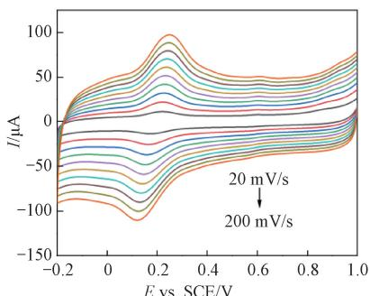  
(a)

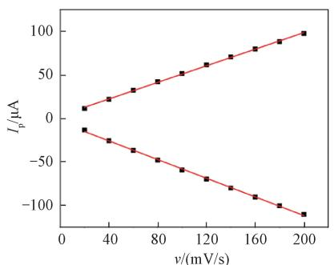  
(b)  
Fig. 8 CV measurements of CFL on  $\mathrm{TBABF}_4 / \mathrm{VXC - }72\mathrm{R} / \mathrm{GCE}$  at various scanning rates: (a) CV curves; (b) relationship between peak current and scanning rate

# 2.4 Linear range and detection limit

Under optimal experimental conditions, CFL is electrochemically titrated by using the DPV, and the peak current increases with the increasing CFL concentration (Fig. 9). In a range of  $0.3 - 10.0 \mu \mathrm{mol} / \mathrm{L}$ , the peak current  $I_{\mathrm{p}}$  and CFL concentration  $C$  show a proportional linear relationship (Fig. 9(b)). The linear equation is

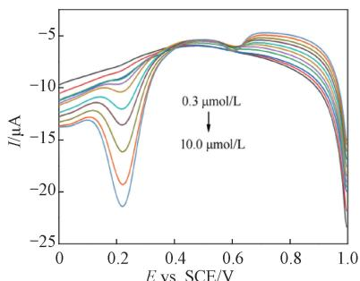  
(a)  
Fig. 9 DPV measurements of CFL at various concentrations on  $\mathrm{TBABF}_4 / \mathrm{VXC - }72\mathrm{R} / \mathrm{GCE}$  : (a) current vs. potential; (b) relationship between peak current and CFL concentration

$I_{\mathrm{p}} = -1.1399C + 0.2505$  ( $R_{\mathrm{p}}^{2} = 0.9986$ ), where  $R_{\mathrm{p}}^{2}$  is the coefficient of determination. The detection limit is estimated to be  $0.2 \mu \mathrm{mol/L}$ . It is worth noting that the sensing performance of the present TBABF $_4$ /VXC-72R/GCE is comparable or even better than that of electrochemical sensors for CFL previously reported[9-10, 23, 26].

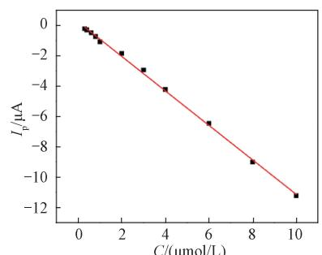  
(b)

# 2.5 Reproducibility, stability and anti-interference ability

Five  $\mathrm{TBABF}_4 / \mathrm{VXC - 72R / GCE}$  were prepared and used to detect  $50.0~\mu \mathrm{mol} / \mathrm{L}$  CFL. As shown in Fig.10(a), five electrodes exhibit basically the same electrochemical response signal with a relative standard deviation of  $3.3\%$  , indicating that  $\mathrm{TBABF}_4 / \mathrm{VXC - 72R / }$  GCE holds good reproducibility.

In order to evaluate the stability of  $\mathrm{TBABF}_4 / \mathrm{VXC}-$

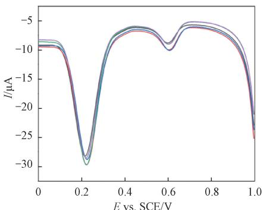  
(a)

72R/GCE, it was continuously used to determine  $50.0\mu \mathrm{mol} / \mathrm{L}$  CFL for one week. After each measurement, the electrode was soaked in absolute ethanol for  $1\mathrm{min}$ , thoroughly rinsed with deionized water, dried and stored in a refrigerator at  $4^{\circ}\mathrm{C}$ . As shown in Fig. 10(b), the peak current remains a little change during measurement with a relative standard deviation of  $2.6\%$ . This demonstrates that  $\mathrm{TBBF}_4/$  VXC-72R/GCE has excellent stability.

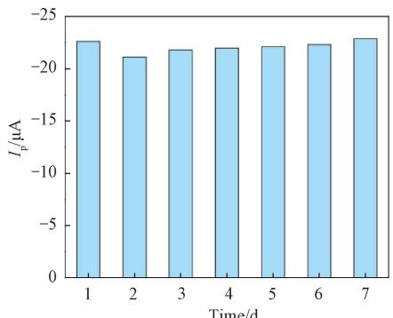  
(b)  
Fig. 10 Reproducibility and stability: (a) DPV curves of CFL on five TBABF $_4$ /VXC-72R/GCEs; (b) peak currents of CFL on the same TBABF $_4$ /VXC-72R/GCE at different storage time

Anti-interference ability of  $\mathrm{TBABF}_4 / \mathrm{VXC - 72R / GCE}$  was investigated by measuring DPV of CFL  $(50.0\mu \mathrm{mol} / \mathrm{L})$  in absence and presence of  $500~\mu \mathrm{mol} / \mathrm{L}$  NaCl, KCl,  $\mathrm{CaCl}_2$  glucose (Glc), sucrose and tryptophan (Trp),  $100~\mu \mathrm{mol} / \mathrm{L}$  dopamine DA), uric acid UA), ascorbic acid AA) and acetaminophen APAP),and  $20\mathrm{mg / mL}$  soluble starch St), respectively.  $I_0$  and  $I_{1}$  represent the peak current values in the absence and presence of the aforementioned interfering substances, respectively Fig.11). There is no significant change of the peak current in the presence of the above potential interfering substances, indicating that the present electrochemical sensor owns excellent anti-interference ability.

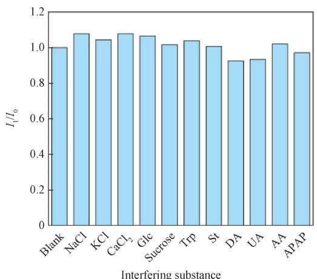  
Fig. 11  $I_{1} / I_{0}$  of CFL on  $\mathrm{TBABF_4 / VXC - 72R / GCE}$  in the presence of various potential interfering substances

# 2.6 Real sample analysis

The CFL levels in real lake water, pharmaceutical tablet and fetal bovine serum samples were determined with  $\mathrm{TBABF}_4 / \mathrm{VXC - 72R / GCE}$ , respectively. At the same time, the standard addition method was used to test the recovery rate. The determination results are listed in Table 1. It can be seen that the recovery rates range from  $93.0\%$  to  $103.8\%$  with a relative standard deviation (RSD) of  $1.1\% -4.2\%$ . Notably, the content of CFL is calculated to be  $239.9\mathrm{mg}$  per tablet, which is very close to the value of  $250.0\mathrm{mg}$  per tablet as claimed by the manufacturer. These indicate that the developed electrochemical sensor has promising application potential for the practical detection of antibiotics in pharmaceutical and environmental samples.

Table 1 Determination of CFL in real samples  

<table><tr><td rowspan="2">Sample</td><td colspan="2">Concentration of CFL /(μmol/L)</td><td rowspan="2">RSD/%</td><td rowspan="2">Recovery rate/%</td></tr><tr><td>Added</td><td>Found</td></tr><tr><td rowspan="3">Lake water</td><td>1.00</td><td>1.02±0.10</td><td>4.2</td><td>102.0</td></tr><tr><td>2.00</td><td>2.07±0.04</td><td>1.8</td><td>103.5</td></tr><tr><td>3.00</td><td>3.06±0.06</td><td>2.1</td><td>102.0</td></tr><tr><td rowspan="3">Tablet</td><td>1.00</td><td>1.90±0.04</td><td>2.4</td><td>96.9</td></tr><tr><td>2.00</td><td>3.02±0.05</td><td>1.4</td><td>102.0</td></tr><tr><td>3.00</td><td>4.11±0.09</td><td>2.2</td><td>103.8</td></tr><tr><td rowspan="3">Fetal bovine serum</td><td>1.00</td><td>0.93±0.01</td><td>1.1</td><td>93.0</td></tr><tr><td>2.00</td><td>1.88±0.04</td><td>2.2</td><td>94.0</td></tr><tr><td>3.00</td><td>2.87±0.03</td><td>1.2</td><td>95.7</td></tr></table>

# 3 Conclusions

$\mathrm{TBABF}_4$  was employed to decorate conductive carbon black VX-72R and coated on GCE for the construction of a novel electrochemical sensor  $(\mathrm{TBABF}_4/$  VX-72R/GCE) for detection of CFL.  $\mathrm{TBABF}_4 / \mathrm{VXC}-$  72R/GCE showed a linear response to CFL in a concentration range of  $0.3 - 10.0~\mu \mathrm{mol} / \mathrm{L}$ , with a detection limit of  $0.2\mu \mathrm{mol} / \mathrm{L}$ . The improved performance could be ascribed to the optimized interfacial affinity of  $\mathrm{TBABF}_4$  that might facilitate the enrichment of antibiotics on the electrode surface. Sensitive detection of CFL in real lake water, pharmaceutical tablet and fetal bovine serum samples was achieved with a satisfactory recovery rate. This will contribute to the development of more sensitive electrochemical sensors for detection of antibiotics based on cheap carbon black decorated with promising electrolytes.

# References

[1] PEREZ-BOU L, GONZALEZ-MARTINEZ A, GONZALEZ-LOPEZ J, et al. Promising bioprocesses for the efficient removal of antibiotics and antibiotic-resistance genes from urban and hospital wastewaters: potentialities of aerobic granular systems [J]. Environmental Pollution, 2024, 342: 123115.  
[2] JIA W L, SONG C, HE L Y, et al. Antibiotics in soil and water: occurrence, fate, and risk[J]. Current Opinion in Environmental Science & Health, 2023, 32: 100437.  
[3] DE MARCO B A, SALGADO H R N. Characteristics, properties and analytical methods of cefadroxil: a review[J]. Critical Reviews in Analytical Chemistry, 2017, 47(2): 93-98.  
[4] ELBALKINY H T, YEHIA A M, RIAD S M, et al. Derivative constant wavelength synchronous fluorescence spectrometry for the simultaneous detection of cefadrine and cefadroxil in water samples [J]. Spectrochimica Acta Part A: Molecular and Biomolecular Spectroscopy, 2020, 229: 117903.  
[5] TUTSL, RASSCHAERT G, HEYNDRICKX M, et al. Detection of antibiotic residues in groundwater with a validated multiresidue UHPLC-MS/MS quantification method [J]. Chemosphere, 2024, 352: 141455.  
[6] REMÍNEK R, FORET F. Capillary electrophoretic methods for quality control analyses of pharmaceuticals: a review [J]. Electrophoresis, 2021, 42(1/2): 19-37.  
[7] MADURAIVEERAN G, SASIDHARAN M, GANESAN V. Electrochemical sensor and biosensor platforms based on advanced

nanomaterials for biological and biomedical applications [J]. Biosensors & Bioelectronics, 2018, 103: 113-129.  
[8] DAVID M, FLORESCU M. Ultrasensitive electrochemical (bio) sensors for therapeutic drug monitoring [J]. Current Opinion in Electrochemistry, 2024, 46: 101501.  
[9] SANZ C G, SERRANO S H P, BRETTC M A. Electroanalysis of cefadroxil antibiotic at carbon nanotube/gold nanoparticle modified glassy carbon electrodes[J].ChemElectroChem，2020，7(9)：2151-2158.  
[10] KASSA A, BENOR A, TIGINEH G T, et al. Characterization and application of a synthesized novel poly (chlorobis (1, 10-phenanthroline) resorcinolcobalt (II) chloride)-modified glassy carbon electrode for selective voltammetric determination of cefadroxil in pharmaceutical formulations, human urine, and blood serum samples [J]. ACS Omega, 2023, 8 (17): 15181-15192.  
[11] HU J M, ZHANG X. Highly sensitive electrochemical detection of nitrite based on cationic surfactant modification of conductive carbon black [J]. Journal of Donghua University (English Edition), 2023, 40(5): 467-474.  
[12] FERREIRA L M C, SILVA P S, AUGUSTO K K L, et al. Using nanostructured carbon black-based electrochemical (bio) sensors for pharmaceutical and biomedical analyses: a comprehensive review [J]. Journal of Pharmaceutical and Biomedical Analysis, 2022, 221: 115032.  
[13] LIANG J M, SONG Y X, ZHAO Y N, et al. A sensitive electrochemical sensor for chiral detection of tryptophan enantiomers by using carbon black and  $\beta$ -cyclodextrin [J]. Mikrochimica Acta, 2023, 190(11): 433.  
[14] ALMEIDA S T, WONG A, FATIBELLO-FILHO O. Electrochemical sensor based on ionic liquid and carbon black for voltammetric determination of Allura red colorant at nanomolar levels in soft drink powders[J]. Talanta, 2020, 209: 120588.  
[15] CETINKAYA A, KAYA S I, YENCE M, et al. Ionic liquid-based materials for electrochemical sensor applications in environmental samples[J]. Trends in Environmental Analytical Chemistry, 2023, 37: e00188.  
[16] GORDUK O. Sensitive electrochemical determination of NADH using an electrode fabricated by intercalation of tetrabutylammonium ions into graphite electrode[J]. Electroanalysis, 2021, 33(5): 1378-1388.  
[17] BUTMEE P, TUMCHARERN G, SAEJUENG P, et al. A direct and sensitive electrochemical sensing platform based on ionic liquid

functionalized graphene nanoplatelets for the detection of bisphenol A [J]. Journal of Electroanalytical Chemistry, 2019, 833: 370-379.  
[18] ZHANG X, ZHANG Y C, MA L X. One-pot facile fabrication of graphene-zinc oxide composite and its enhanced sensitivity for simultaneous electrochemical detection of ascorbic acid, dopamine and uric acid [J]. Sensors and Actuators B: Chemical, 2016, 227: 488-496.  
[19] ZHANG X, WANG K P, ZHANG L N, et al. Phosphorus-doped graphene-based electrochemical sensor for sensitive detection of acetaminophen [J]. Analytica Chimica Acta, 2018, 1036: 26-32.  
[20] YAMADA T, MIZUNO M. Infrared and terahertz spectroscopic investigation of imidazolium, pyridinium, and tetraalkyl-ammonium tetrafluoroborate ionic liquids [J]. ACS Omega, 2022, 7(34): 29804-29812.  
[21] XIAO F, ZHAO F Q, LI J W, et al. Sensitive voltammetric determination of chloramphenicol by using single-wall carbon nanotube-gold nanoparticle-ionic liquid composite film modified

glassy carbon electrodes [J]. Analytica Chimica Acta, 2007, 596(1): 79-85.  
[22] ENACHE T A, OLIVEIRA-BRETT A M. Phenol and para-substituted phenols electrochemical oxidation pathways [J]. Journal of Electroanalytical Chemistry, 2011, 655 (1): 9-16.  
[23] SANZ C G, SERRANO S H P, BRETTC M A. Electrochemical characterization of cefadroxil  $\beta$ -lactam antibiotic and Cu (II) complex formation [J]. Journal of Electroanalytical Chemistry, 2019, 844: 124-131.  
[24] YANG X Y, KIRsCH J, FERGUS J, et al. Modeling analysis of electrode fouling during electrolysis of phenolic compounds [J]. Electrochimica Acta, 2013, 94: 259-268.  
[25] BARD A J, FAULKNER L R. Electrochemical methods: fundamentals and applications [M]. New York: John Wiley & Sons, 2001.  
[26] ATIF S, BAIG J A, AFRIDI H I, et al. Novel nontoxic electrochemical method for the detection of cefadroxil in pharmaceutical formulations and biological samples [J]. Microchemical Journal, 2020, 154: 104574.

# 基于四丁基四氟硼酸铵修饰的导电炭黑开发头孢羟氨苄抗生素电化学传感器

朱宗贤1，张 焰1,2\*

1. 东华大学 生态纺织教育部重点实验室，化学与化工学院，上海201620  
2. 国家先进印染技术创新中心，山东泰安271000

摘要：抗生素的检测对公共健康而言非常重要。该研究开发了一种新颖简单的可灵敏检测头孢羟氨苄（cefadroxil，CFL）抗生素的电化学传感器。通过将四丁基四氟硼酸铵（tetrabutylammonium tetrafluoroborate， $\mathrm{TBABF}_4$ ）修饰的导电炭黑（商品名VXC-72R）涂覆在玻碳电极（glassy carbon electrode，GCE）上，构筑了电化学传感器  $\mathrm{TBABF}_4 / \mathrm{VXC - 72R} / \mathrm{GCE}$  。研究发现CFL在该传感器上于  $0.22\mathrm{V}$  处有一个还原峰。该传感器在  $0.3\sim 10.0~\mu \mathrm{mol} / \mathrm{L}$  浓度范围内对CFL显示出良好的线性响应特性，检测限为  $0.2\mu \mathrm{mol} / \mathrm{L}$  （信噪比为3）。该传感器表现出良好的重现性、储备稳定性和抗干扰能力，并被成功应用于湖水、药剂和胎牛血清样品中CFL的检测。

关键词：电化学传感器；导电炭黑；四丁基四氟硼酸铵；头孢羟氨苄抗生素