# Preparation and Properties of Bacterial Cellulose / Hyaluronic Acid Oral Disintegrating Films

WU Xiaoyan, SONG Wei, CHEN Shuang, XIAO Ru∗

State Key Laboratory of Advanced Fiber Materials, College of Materials Science and Engineering, Donghua University, Shanghai 201620, China

Abstract: The oral disintegrating film ( ODF ) offers significant advantages such as superior patient compliance and rapid action onset as a form of solid drug delivery. However, the drug loading efficiency and dosage of the ODF currently available in the market are limited. To enhance the drug loading efficiency, with bacterial cellulose ( BC) and hyaluronic acid ( HA) as film-forming agents, glycerol (GL) as a plasticizer, and diprophylline ( Dilor) as the model drug, a Dilor-ODF was prepared by a solvent casting method for the treatment of acute asthma-related diseases. The BC nano-network structure was utilized to augment the drug loading efficiency of the Dilor-ODF while HA and GL were used to improve the elongation at break. The disintegration time, drug loading efficiency and drug releasing rate, and tensile properties of the Dilor-ODF were mainly evaluated. The results indicated that the Dilor-ODF exhibited a smooth surface with a uniform thickness and a maximum drug loading efficiency of $\mathbf { 5 1 . 1 0 { \pm } 0 . 0 8 } ) \%$ . The time for complete disintegration and that for drug release in simulated oral saliva were less than 30 and 90 s, respectively, indicating the effect of rapid release. The tensile strength and elongation at break of the Dilor-ODF were $\left( 4 6 . 3 \pm 2 . 8 \right)$ ) MPa and $( { \bf 1 . 9 \pm 0 . 2 } ) \%$ , respectively. The thermal decomposition temperature of the Dilor-ODF was higher than ${ \bf 2 0 0 ~ \mathrm { ~ C ~ } }$ , satisfying subsequent processing demand.

Keywords: oral disintegrating film (ODF); bacterial cellulose ( BC ); hyaluronic acid ( HA ); solvent casting method; diprophylline (Dilor)

CLC number: R944. 4; TB43

Document code: A

Article ID: 1672-5220(2025)04-0339-09

Open Science Identity (OSID)

# 0 Introduction

An oral disintegrating film (ODF) is a type of films prepared with hydrophilic polymers and loaded with a dose of the drug. When placed in the mouth, it rapidly dissolves upon contact with saliva, releasing the drug within seconds to one minute for absorption through the oral mucosa or tongue[1-3] . Its ease of administration makes it suitable for patients with swallowing difficulties or specific diseases, thereby enhancing patient

compliance. Additionally, it allows for rapid action onset at low drug doses and circumvents the first-pass effect to improve drug bioavailability[4-6] . However, the application of the ODF is still limited by factors such as vulnerability in high-humidity environments and the limited capacity to accommodate high drug doses. The drug loading efficiency of the ODF in the existing market and relevant research is less than $40 \%$ due to the tensile properties of films, which necessitates large quantities for drugs with high dosages[7-8] . SmartFilm ?? developed by Seoul Pharma the Republic of Korea is capable of loading $\mathrm { 1 4 0 ~ m g }$ hydrophilic or hydrophobic drug with a drug loading efficiency of $2 4 \%$ . ThinsolTM developed by BioEnvelop ( Canada) uses carboxymethyl cellulose as a film-forming material for loading heat-sensitive drugs with a drug loading efficiency of $3 7 \% ^ { [ 9 ] }$ . Ouda et al.[10] prepared an ODF from hydroxypropyl methylcellulose (HPMC) and guar gum for loading ibuprofen, and the maximum loading of ibuprofen in a single film was $2 0 . 7 \ \mathrm { m g }$ (a drug loading efficiency of $3 5 . 2 3 \%$ ). In general, the dosage of ibuprofen for adults is $0 . 2 { \mathrm { - } } 0 . 4 \ { \mathrm { g / d o s e } }$ , and then 10 - 20 tables of the film are needed to be taken. Within $5 \ \mathrm { m i n }$ , $100 \%$ of the drug was released, and the tensile strength and elongation at break of the film were $5 . 0 \ \mathrm { M P a }$ and $3 . 5 \%$ , respectively. Liu et al.[11] prepared an ODF containing lutein using HPMC and polyvinyl alcohol (PVA) with a drug loading capacity of $\mathrm { { . 0 . 2 3 0 \pm } }$ 0. 003 $\mathrm { m g / c m ^ { 2 } }$ . The recommended daily intake of lutein for adults is $1 0 - 2 0 \ \mathrm { \ m g }$ , and $\mathrm { 4 3 - 8 8 ~ c m ^ { 2 } }$ of the ODF would be required. It disintegrated rapidly within $( 2 9 \pm 8 )$ s and released $7 5 \%$ of the drug within $1 0 \ \mathrm { m i n }$ . Increasing the ODF drug loading capacity can reduce the amount or volume of films required.

The matrix of the ODF is typically composed of hydrophilic polymers, primarily focusing on natural polymers ( polysaccharides and proteins, such as amylopectin, maltodextrin and pullulan) and synthetic or semi-synthetic polymers ( polyvinyl pyrrolidone, PVA, polyethylene oxide, etc. ) [1] . Most of the current studies on the ODF have combined natural polymers with

synthetic polymers to achieve superior tensile properties and rapid disintegration. However, synthetic polymers present the potential threat of cytotoxicity[5] . Bacterial cellulose ( BC) is a natural nanocellulose with a higher purity and a better plasticity than plant-derived nanocellulose. Hyaluronic acid ( HA) exhibits excellent tensile and film-forming properties as a natural highly hydrophilic polysaccharide. Both BC and HA are widely used as drug delivery carriers with good biocompatibility, and various studies have confirmed their non-cytotoxicity to organisms[4, 12-13] . Busuioc et al. [14] prepared singlelayer and multi-layer composite films by using BC and PVA as film-forming agents for loading antibiotic tetracycline hydrochloride, which took about $1 8 \mathrm { ~ h ~ }$ and $^ { 4 - 5 \mathrm { ~ h ~ } }$ for full drug release in an aqueous solution, respectively. Good antimicrobial activity was confirmed by using Staphylococcus aureus ( S. aureus ) and Escherichia coli ( E. coli) . Cacicedo et al.[15] prepared a film with high methoxyl pectin (HMP) modified BC for the delivery of levofloxacin, and the maximum drug loading was $6 . 2 3 ~ \mathrm { m g / g }$ . The film had good antibacterial activity against S. aureus, and in vivo studies demonstrated that it had no obvious cytotoxicity to mammalian cells. Ahn et al.[16] developed an ODF containing vitamin D and calcium by using HA. The mass of vitamin D in a single film ${ 2 \ \mathrm { c m } \times 3 \ \mathrm { c m } }$ ) was $3 2 . 0 3 \mathrm { - } 4 0 . 0 7 ~ \mu \mathrm { g }$ , and the mass of calcium was $1 . 7 6 { - } 8 . 4 5 ~ \mathrm { m g }$ . Since the increase in the calcium mass would extend the disintegration time of the film, the addition of calcium is insufficient. In vivo studies showed that it was not cytotoxic.

Given the convenient administration and rapid drug release, ODFs have unique application advantages in the relief or treatment of respiratory diseases such as asthma. Zhou et al.[17] developed an ODF of formoterol fumarate by using HPMC, glycerin and pregelatinized starch for rapid release of asthma. Each film $\mathrm { 4 ~ c m ^ { 2 } }$ ) contained $4 4 . 3 3 ~ \mu \mathrm { g }$ drug which could disintegrate within 57 s and release 99. $2 4 \%$ of the drug within $3 \ \mathrm { m i n }$ .

Diprophylline ( Dilor) is a smooth muscle relaxant commonly used in the form of injection for the treatment of bronchial asthma, chronic emphysema, acute respiratory failure and other diseases, and has poor compliance for patients. Conventional oral dosage forms ( capsules, tablets, etc. ) can only be used for maintenance treatment of chronic asthma and prevention of acute exacerbations due to their slow onset, so making Dilor into an ODF can avoid such constraints[18] . For adults, the dosage of Dilor is $0 . 1 { - } 0 . 2 \ \mathbf { g } / \mathrm { d o s e }$ , and when the drug loading efficiency of the ODF is low, a larger quantity of films needs to be taken. The threedimensional ( 3D ) nano-network structure of BC can accommodate a greater quantity of active pharmaceutical ingredients, thereby enhancing its drug loading efficiency. Meanwhile, HA is employed to reinforce the 3D nano-network structure, ensuring that the ODF

possesses sufficient tensile properties. The design of BC and HA compounds would be a favorable exploration to achieve the goal of combining high drug loading efficiency and tensile properties.

# 1 Materials and Methods

# 1. 1 Materials

BC aqueous dispersion with a mass fraction of $0 . 8 \%$ was provided by Qixin Chemical Products Department, Guilin, China. HA with a purity of $9 7 \%$ and a relative molecular mass of 600 000 was provided by Wendong (Shanghai) Chemical Co., Ltd., China. Glycerol (GL) with a purity of $9 9 \%$ was provided by Shanghai Aladdin Biochemical Science and Technology Co., Ltd., China. Dilor with a purity higher than $9 8 \%$ and phosphate buffer $\mathrm { { . 1 0 ~ \times , ~ \ p H } }$ range of 7. 2 to 7. 4 ) were provided by Shanghai Adamas Reagent Co., Ltd., China. Hydrochloric acid ( HCl, analytical reagent ) was provided by Sinopharm Chemical Reagent Co., Ltd., China.

# 1. 2 Preparation of films

With BC and HA as the film-forming agents, ODFs were prepared by a solvent casting method[19-20] . Firstly, HA $( \ 0 . 4 \ \mathrm { \ g } )$ and GL $\left( \begin{array} { l l } { 0 . 0 8 } & { \mathbf { g } } \end{array} \right)$ were dissolved in deionized water ( $\mathrm { 2 0 ~ m L }$ ). Secondly, a quantity ( based on the total mass of the film-forming agents) of Dilor was dissolved in deionized water $\mathbf { 9 . 6 } \ \mathrm { m L }$ ), and BC aqueous dispersion ( $\mathrm { 5 0 ~ \ g ~ } )$ was added to the above solution. Then, the mixture was stirred and mixed evenly to obtain a film-forming solution a mass fraction of $1 \%$ and a BC / HA mass ratio of $1 { : } 1$ ) . After completely defoaming, the film-forming solution was uniformly coated on the surface of a clean glass plate ( $1 5 \ \mathrm { c m } \ \times$ $1 5 ~ \mathrm { c m }$ ) with the help of a spin coater ( EZ4, Jiangsu Leibeau Scientific Instrument Co., Ltd., China ). The solvent was evaporated at $6 0 ~ \mathrm { ~ ‰ ~ }$ for $^ \textrm { \scriptsize 5 h }$ . Finally, the B1H1 / GL@ Dilor ( BC and HA as film-forming agents, GL as a plasticizer, and Dilor as the model drug) film was cut after release. B1H1 ( only BC and HA as filmforming agents ) and B1H1 / GL ( without the model drug) films were prepared in the same way.

# 1. 3 Characterization

# 1. 3. 1 Morphological characterization

To assess the film-forming properties and the compatibility among the film-forming components, the appearance of the film was evaluated, including the flexibility, thickness uniformity and bubble-free property. The film was pre-frozen and freeze-dried for $2 4 \mathrm { ~ h ~ }$ , and sprayed with gold for 120 s. The micromorphology of the sample surface was observed by a scanning electron microscope ( SU8010, Hitachi, Japan). The film was cut into a size of $2 \ \mathrm { c m } \ \times \ 6 \ \mathrm { c m }$ , and the thickness of the film was measured with a digital thickness gauge AWT-CHY01 Ewit Co. Ltd. China). Three points were randomly selected for each film to obtain the average thickness.

# 1. 3. 2 Chemical structure characterization

The chemical structure of the films was analyzed by

a Fourier transform infrared ( FTIR ) spectrometer ( Nicolet iS50 ABX, Thermo Fisher, USA ) at room temperature to investigate the influence of the film composition on the chemical structure of the loaded drug. The scanning range was $4 ~ 0 0 0 { - } 5 0 0 ~ \mathrm { c m } ^ { - 1 }$ , the resolution was $4 ~ \mathrm { c m } ^ { - 1 }$ , the scanning times were 32, and the films were dried before testing.

# 1. 3. 3 Thermal stability characterization

To evaluate whether the temperature required in the film preparation process affects the film properties, the thermal stability of the film in the air atmosphere was tested with a thermogravimetric analyzer ( 209F1, NETZSCH, Germany). The temperature range was 30- $8 0 0 ~ \mathrm { { ‰} }$ , and the temperature increase rate was $1 0 ~ \mathrm { { ‰} }$ .

# 1. 3. 4 Drug loading efficiency and encapsulation rate test

The drug loading efficiency and encapsulation rate were determined by using simulated oral saliva. The simulated oral saliva ( $\mathrm { p H } = 6 . 8$ ) was prepared by phosphate buffer and HCl.

The Dilor standard curve was plotted as follows. The above simulated oral saliva was used as the solvent to prepare a solution with a drug mass concentration of $0 . 1 0 0 ~ \mathrm { { m g / m L } }$ , which was then diluted to 0. 050, 0. 045, 0. 040 0. 035 0. 030 0. 025 0. 020 0. 015 0. 010 and $0 . 0 0 5 ~ \mathrm { m g / m L }$ , respectively. The absorbance of the above solutions at the maximum absorption wavelength was measured by a UV-visible near-infrared spectrometer UV3600 Shimadzu Japan at $2 0 0 { - } 5 0 0 \ \mathrm { n m }$ and the Dilor standard curve was plotted by regression of the absorbance to the mass concentration.

A quantity of B1H1 / GL $@$ Dilor, namely Dilor-ODF, was dissolved in the simulated oral saliva (10 mL) and then the solution (1 mL) was sucked up and diluted with the simulated oral saliva. The supernatant was taken to measure the absorbance, and the mass of Dilor was obtained according to the absorbance-mass concentration standard curve. Then the drug loading efficiency $R$ and the encapsulation rate $E$ of the sample were calculated. Three parallel tests were conducted for each sample to obtain the average value[21] .

$$
R = \frac {m _ {\mathrm {ac}}}{m _ {\mathrm {s}}} \times 100 \% , \tag{1}
$$

$$
E = \frac {m _ {\mathrm {ac}}}{m _ {\mathrm {th}}} \times 100 \% \tag{2}
$$

where $m _ { \mathrm { a c } }$ represents the actual mass of Dilor in the sample; $m _ { \mathrm { s } }$ represents the mass of the sample; $m _ { \mathrm { t h } }$ represents the theoretical mass of Dilor in the sample.

# 1. 3. 5 Disintegration time and drug release rate test

To investigate the impact of film-forming agents on the disintegration time and drug release capacity of the film, the disintegration time and drug release rate of the film were measured by using the simulated oral saliva.

The Dilor-ODF with a size of $2 \ \mathrm { c m } \ \times \ 2$ cm was placed into the simulated oral saliva $\mathrm { 2 0 ~ m L }$ ) at $( 3 7 . 0 \pm$

0. 5) ℃ , and the disintegration time from contact with the solution to complete disintegration of the film was recorded at a stirring speed of $2 0 0 ~ \mathrm { r / m i n }$ . Three parallel tests were conducted for each sample to obtain the average value.

A quantity of the Dilor-ODF was placed into the simulated oral saliva ( $5 0 ~ \mathrm { m L }$ ) at $( 3 7 . 0 { \pm } 0 . 5 ) \textrm { ‰}$ and a stirring speed of $1 0 0 ~ \mathrm { r / m i n }$ , and the timer was started immediately. The solution 3 mL was taken 14 times at 15 s, 30 s, 45 s, 60 s, 75 s, 90 s, 105 s, 120 s, 3 min, $5 \mathrm { { m i n } }$ 10 min $2 0 \ \mathrm { m i n }$ $3 0 \ \mathrm { m i n }$ and $6 0 \ \mathrm { m i n }$ and the simulated oral saliva at the same temperature and with the same volume was added. The filtrate (1 mL) was taken, added to the simulated oral saliva ( $9 ~ \mathrm { m L }$ ), and then mixed evenly. The absorbance was measured and the Dilor mass was calculated. The drug release rate $C _ { \mathrm { r } }$ of the sample is

$$
C_{\mathrm{r}} = \frac{3\sum_{i = 1}^{14}C_{i - 1} + 50C_{i}}{m_{\mathrm{th}}}\times 100\% , \tag{3}
$$

where $C _ { i }$ is the measured mass concentration of Dilor at the ith time of sampling.

# 1. 3. 6 Tensile property test

The tensile strength and elongation at break of the film were determined by using an electronic universal material testing machine ( INSTRON/ 5969, INSTRON, USA) to assess whether the film could be maintained intact during processing, packaging, storage and use. The maximum load of the sensor was $1 0 0 ~ \mathrm { N }$ , the fixture spacing was $2 0 \ \mathrm { m m }$ , and the tensile rate was $1 0 \ \mathrm { m m / m i n }$ . Three parallel tests were conducted for each sample to obtain the average value, and the samples were dried before testing.

# 2 Results and Discussion

# 2. 1 Morphological analyses

The optical photographs and thicknesses of BC, HA, B1H1, B1H1 / GL and B1H1 / GL $@$ Dilor films are shown in Figs. 1 and 2, respectively. The B1H1 film exhibits a smooth and flat surface with a uniform thickness Fig. 1 c indicating good compatibility between BC and HA. The good film formation and flexibility of the B1H1 / GL $@$ Dilor film can be seen in Fig. 1(e). The thickness of the B1H1 / GL $@$ Dilor film significantly increases to $0 . 0 2 5 { \scriptstyle \pm 0 . 0 0 1 }$ ) mm due to the rise of the total solid content in the film matrix as shown in Fig. 2. The scanning electron microscopy (SEM) images of BC, HA, B1H1, B1H1/ GL and B1H1/ GL@Dilor films and Dilor are shown in Fig. 3. The BC film displays the typical 3D nano-network structure and porous morphology, while the surface of the HA film is uniform and compact without porosity, resulting in a lower thickness compared to the BC film. In the B1H1 film HA is attached to the BC nano-network which avoids the collapse of the BC nano-network structure during drying and increases the film thickness. The addition of GL promotes the dispersion of HA, which makes the film

more compact and uniform and smoother, thereby reducing the film thickness. As shown in Fig. 3(e), the size of Dilor particles is uneven, and Dilor fills the pores of the matrix network or is attached to the surface of the

matrix when loaded into the film. As shown in Fig. 3(f), the size of Dilor particles is smaller and more even and no aggregation is displayed. Thus, it is assumed that recrystallization of Dilor occurs after dispersion.

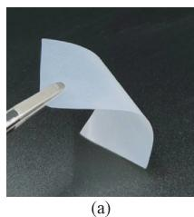

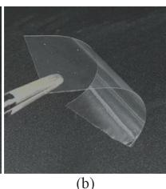

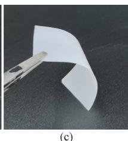

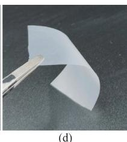

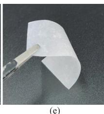

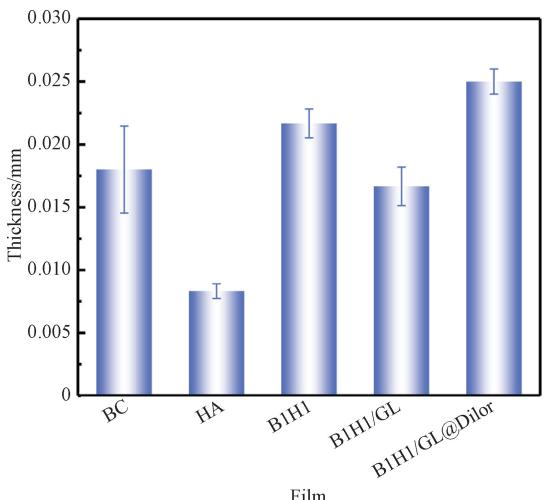  
Fig. 1 Optical photographs of films: (a) BC; (b) HA; (c) B1H1; (d) B1H1 / GL; (e) B1H1 / GL@Dilor   
Fig. 2 Thicknesses of BC, HA, B1H1, B1H1 / GL and B1H1 / GL@Dilor films

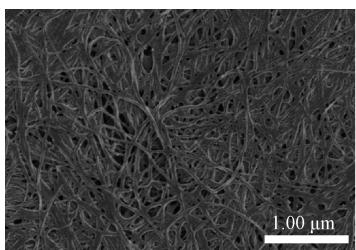  
(a)

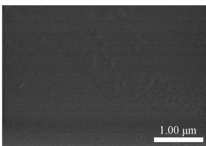  
(b)

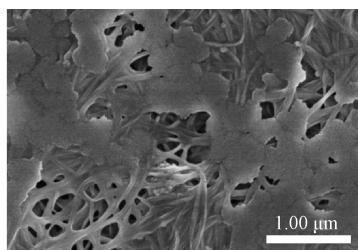  
(c）

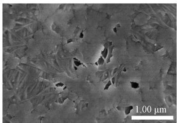  
(d)

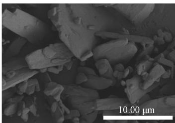  
(e)

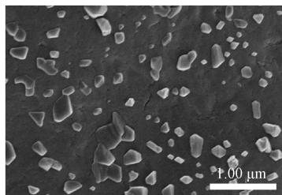  
(f)   
Fig. 3 SEM images: (a) BC film; (b) HA film; (c) B1H1 film; (d) B1H1 / GL film; (e) B1H1 / GL@Dilor film; (f) Dilor

# 2. 2 Chemical structure analyses

The FTIR spectra of BC HA B1H1 B1H1 / GL and B1H1 / GL $@$ Dilor films, and Dilor are shown in Fig. 4. As shown in Fig. 4 ( a), the absorption peak at $\mathrm { 3 3 4 1 ~ c m ^ { - 1 } }$ is the stretching vibration peak of the O H group caused by intermolecular hydrogen bonds, and the absorption peak at $2 ~ 8 9 5 ~ \mathrm { c m } ^ { - 1 }$ is the stretching vibration of $\mathrm { C H _ { 2 } { - } C H _ { 2 } }$ , which are characteristic absorption peaks of

polysaccharides. The absorption peak at $1 \ 0 5 4 \ \mathrm { c m } ^ { - 1 }$ is caused by the stretching vibration of the ${ \mathrm { C } } { \mathrm { - } } { \mathrm { O } }$ bond, which is the characteristic peak of BC. The peak shape of the HA film is different from that of the BC film which may be caused by the —NH vibration in HA. The FTIR spectrum of the B1H1 film exhibits a relatively obvious amino bending vibration peak at $1 4 0 7 ~ \mathrm { c m } ^ { - 1 }$ which is consistent with that of HA, indicating the presence of HA

in the B1H1 film. The absorption peak of the B1H1 film at $\mathrm { 3 3 4 l ~ c m ^ { - 1 } }$ is the same as that of the BC film and there is an absorption peak of the amide Ⅱband at $1 5 5 8 ~ \mathrm { { c m } ^ { - 1 } }$ . It is inferred that BC and HA are not connected through the hydrogen bonding, but through the interaction force between the amide group and hydrogen. As shown in

Fig. 4(b), the presence of characteristic absorption peaks related to Dilor in the FTIR spectrum of the B1H1/ GL $@$ Dilor film confirms that Dilor is indeed loaded within the film. The peak positions of the B1H1/ GL@Dilor film remain unchanged, indicating that the drug does not react chemically with the film-forming agents or plasticizer.

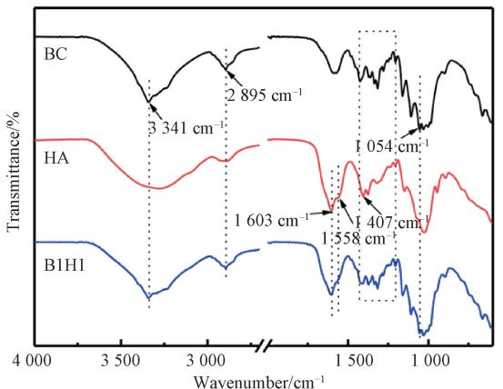  
(a)

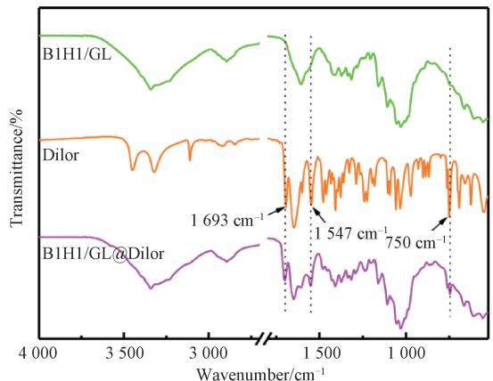  
(b)   
Fig. 4 FTIR spectra: ( a) BC, HA and B1H1 films; ( b) B1H1 / GL and B1H1 / GL@Dilor films, and Dilor

# 2. 3 Thermal stability analyses

The thermogravimetry ( TG ) and derivative thermogravimetry ( DTG ) curves of BC, HA, B1H1, B1H1/ GL and B1H1/ GL $@$ Dilor films, and Dilor are shown in Fig. 5. The initial mass of all films at $3 0 . 0 \mathrm { - } 1 0 0 . 0 ~ \mathrm { ~ \textdegree ~ }$ shows a decrease due to the evaporation of absorbed water. The highest mass loss at $3 0 . 0 \mathrm { - } 1 0 0 . 0 ~ \mathrm { \textdegree C }$ is observed in the HA film, attributable to its higher water absorption capacity in the environment. The high mass loss for all films is observed at $2 0 0 . 0 - 3 0 0 . 0 \mathrm { ~ ‰ ~ }$ , which is attributed to the degradation of polysaccharides. As shown in Fig. 5(a), the initial decomposition temperature of the BC film is 262. 5 ℃ and that of the HA film is $2 3 0 . 1 \mathrm { ~ \~ } \mathrm { ~ \mathcal ~ { ~ C ~ } ~ }$ . The initial decomposition temperature of the HA film is lower than that of the BC film, which is caused by its amorphous structure. Two mass loss stages are observed in the B1H1 film with decomposition temperatures of 211. 0 and $3 7 8 . 5 \mathrm { ~ \textit ~ { ~ C ~ } ~ }$ , respectively. The thermal decomposition temperature at the

second stage significantly increases due to the formation of hydrogen bonds between BC and HA which will be broken during heating, resulting in the gradual destruction of the ordered structure of the B1H1 film. As shown in Fig. 5(b), the B1H1/ GL film has four mass loss stages, among which the main mass loss stages occur at $\mathrm { 1 5 3 . 1 - 2 6 3 . 9 ~ \mathrm { ~ ‰ ~ } }$ and $2 6 3 . 9 - 3 8 2 . 9 \mathrm { ~ \textbar { ~ } C }$ . The thermal decomposition temperature of the B1H1 / GL film is lower than that of the B1H1 film, which is attributed to that the addition of GL weakens the intermolecular force. The thermal decomposition temperature of Dilor is 319. 8 ℃, whereas the B1H1/ GL $@$ Dilor film has three mass loss stages and begins to thermally degrade at about $2 7 0 . 0 \mathrm { ~ } \mathrm { } ^ { \circ } \mathrm { C }$ , indicating the compatibility between Dilor and other components of the film. The results demonstrate that the Dilor-ODF is thermally stable at $2 0 0 . 0 ~ \mathrm { { ^ { 2 } C } }$ , and a temperature of $6 0 . 0 \mathrm { { \ : { V } } }$ required in the preparation process by the solvent casting method does not adversely affect the structure of the Dilor-ODF.

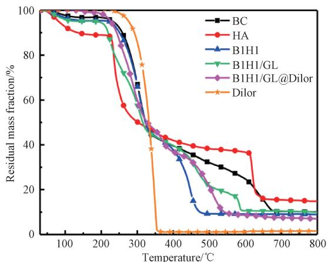  
(a)

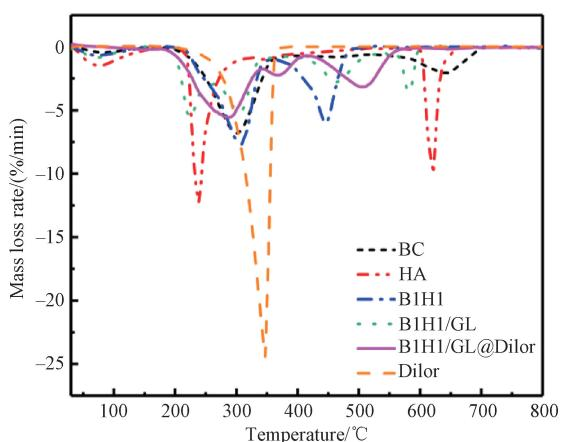  
  
Fig. 5 Thermal properties of BC, HA, B1H1, B1H1 / GL and B1H1 / GL $@$ Dilor films, and Dilor: (a) TG curves; (b) DTG curves

# 2. 4 Drug loading efficiency and encapsulation rate

The absorbance curves of Dilor solutions at different mass concentrations are shown in Fig. 6 ( a ), the absorbance-mass concentration standard curve of Dilor is shown in Fig. 6( b), and the drug loading efficiency and encapsulation rate of the B1H1 / GL $@$ Dilor film with different mass ratios of Dilor to the film-forming agents are shown in Figs. 6 ( c ) and 6 ( d ), respectively. Dilor exhibits a strong absorption at a wavelength of $2 7 3 . 5 \ \mathrm { n m }$ . According to the relationship between the mass concentration $x$ and absorbance $y$ , the standard curve is $y = 3 5 .$ . 087 27x-0. 003 64 $R ^ { 2 } { = } 0 . 9 9 9$ $R ^ { 2 }$ is the coefficient of determination and represents the degree of agreement between the experimental data and the standard curve). When the mass ratio is lower than $120 \%$ , the encapsulation rate of the film for Dilor exceeds $9 8 \%$ . However, the

encapsulation rate gradually decreases to $8 5 \%$ when the mass ratio is higher than $120 \%$ . Therefore, the optimal mass ratio is $120 \%$ , and the drug loading efficiency of the film and the encapsulation rate of the film for Dilor are (51. $1 0 { \pm } 0 . 0 8 ) \%$ and $( 9 7 . 9 0 { \pm } 0 . 1 5 ) \%$ , respectively. The results are consistent with the changes in the appearance of the B1H1/ GL $@$ Dilor film. As the mass ratio exceeds $120 \%$ , there is white substance on the surface of the film, which may be unencapsulated Dilor, and the brittle film is prone to breakage. The drug loading efficiency of the B1H1/ GL $@$ Dilor film is significantly improved compared with the existing ODF or other studies, and the expected goal of increasing drug loading efficiency by leveraging the 3D nano-network structure of BC is achieved. The higher drug loading efficiency facilitates the reduction of the number of films required to be taken.

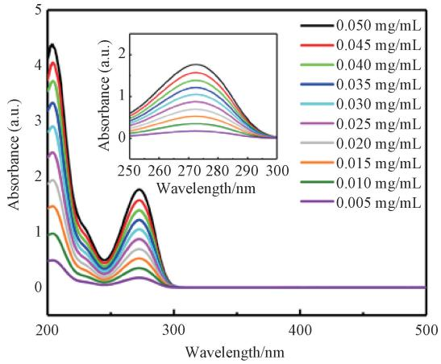  
(a)

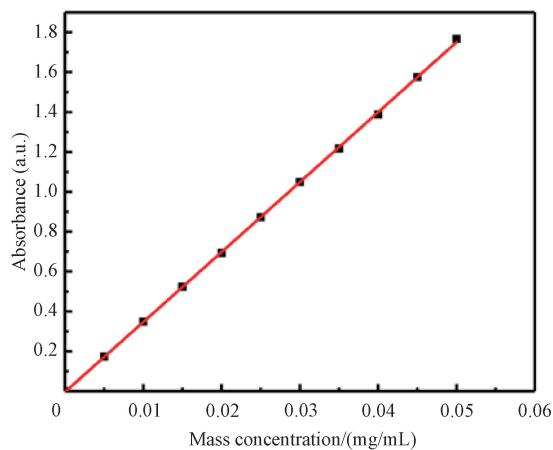

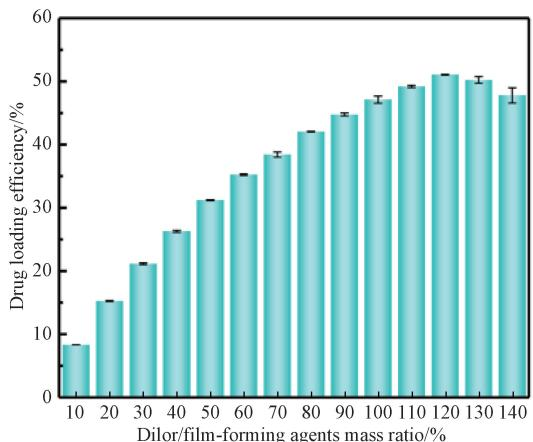  
（c）

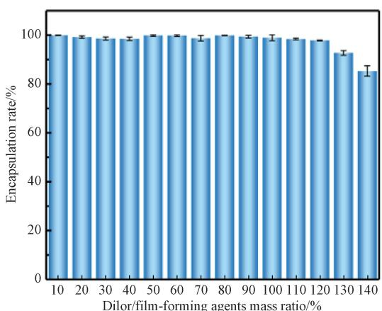  
(d)   
Fig. 6 Drug loading properties: ( a) absorbance curves of Dilor solutions at different mass concentrations; ( b) absorbance-mass concentration standard curve of Dilor; ( c) drug loading efficiency of B1H1 / GL@Dilor films; ( d) encapsulation rate of B1H1 / GL@Dilor films

# 2. 5 Disintegration time and drug release rate

The disintegration time of BC, HA, B1H1, B1H1 / GL and B1H1 / GL@120%Dilor ( the Dilor / film-forming agents mass ratio is $120 \%$ ) films is shown in Fig. 7( a) , and the drug release rate of B1H1 / GL@ 120% Dilor film is shown in Fig. 7( b). The disintegration time of both BC and HA films is less than $1 \ \mathrm { m i n }$ , attributable to the abundance of hydroxyl and carboxyl hydrophilic groups

that readily form hydrogen bonds with water molecules and dissolve in water. The disintegration time of the BC film is longer than that of the HA film due to the interlaced entanglement of nanofibers. The filling of HA in the B1H1 film plays a supportive role in the structure of the BC nano-network, making the film denser and prolonging the disintegration time. The addition of small molecules GL weakens the interaction between

macromolecules, making the film more prone to rupture, and thus the B1H1 / GL film disintegrates more rapidly. The disintegration time of the B1H1 / GL $@$ $120 \%$ Dilor film decreases significantly, potentially related to the large amount of the drug attached to the surface of the film, which increases the specific surface

area of the film in contact with water. The B1H1 / GL $@$ $120 \%$ Dilor film completely disintegrates within 30 s, and the drug release rate is $9 9 . \ 7 { \pm } 0 . \ 3 ) \ \%$ within 90 s, higher than the average of existing studies. The drug release rate facilitates rapid drug delivery in emergency situations.

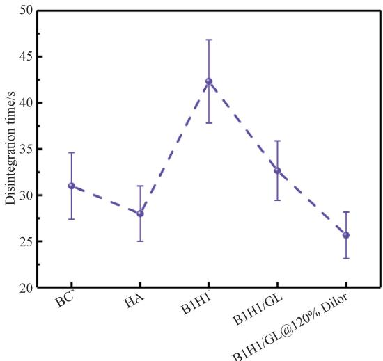  
Film   
(a)

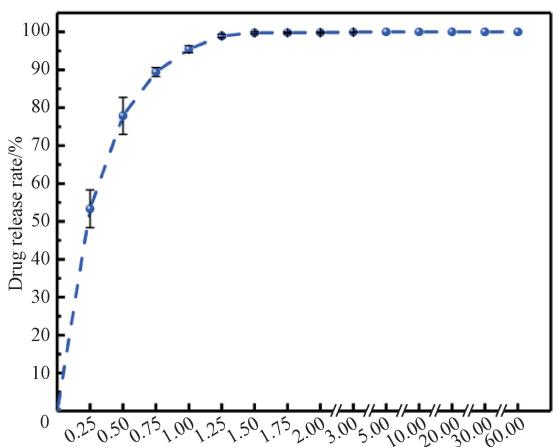  
Time/min   
(b)   
Fig. 7 Drug release properties: ( a) disintegration time of BC, HA, B1H1, B1H1 / GL and B1H1 / GL@120%Dilor films; ( b) drug release rate of B1H1 / GL@120%Dilor film

# 2. 6 Tensile properties

The tensile stress-strain curves, tensile strengths and elongations at break of BC, HA, B1H1, B1H1 / GL and B1H1/ GL $( \omega 1 2 0 \%$ Dilor films are shown in Fig. 8. The tensile stress-strain curves in Fig. 8 a show that the BC film exhibits brittle fracture while the HA film exhibits ductile fracture. The BC film has a higher tensile strength and a lower elongation at break while the HA film exhibits a higher elongation at break and a better flexibility as BC has a higher crystallinity and HA has more amorphous regions. The tensile properties of the B1H1 film are optimized due to the formation of more hydrogen bonds between BC and HA and the intermolecular distance between them is reduced. This results in a more compact nano-network structure, increased tensile strength, but reduced flexibility. The

elongation at break of the B1H1 / GL film increases. This may be attributed to the entry of small molecules GL into the macromolecular chain network structure, which weakens the intermolecular forces and increases the mobility of the molecular chains and thus enhances the flexibility of the film. With the addition of Dilor, the drug is almost filled in the nano-network structure, which hinders the formation of hydrogen bonding and the slip of molecular chains. Therefore the tensile strength and elongation at break of the film decrease significantly, and the tensile stress-strain curve shows brittle fracture. The tensile strength and elongation at break of B1H1/ GL $@$ $120 \%$ Dilor film are $4 6 . 3 { \pm } 2 . 8 \rangle$ MPa and $( 1 . 9 \pm 0 . 2 ) \%$ respectively meeting the requirements of tensile properties for film preparation, packaging and use.

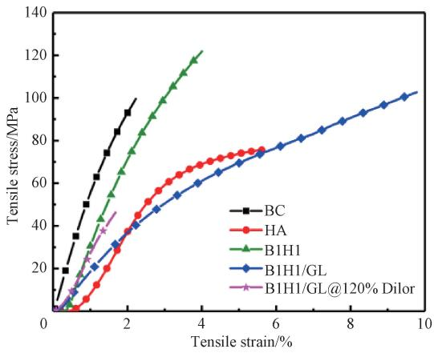  
(a)

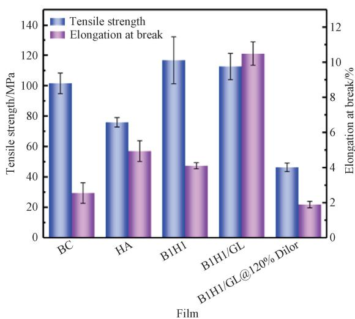  
(b)   
Fig. 8 Tensile properties of BC, HA, B1H1, B1H1 / GL and B1H1 / GL $@$ 120% Dilor films: ( a) tensile stress-strain curves; ( b) tensile strengths and elongations at break

# 3 Conclusions

In this study, the ODF was prepared with BC and HA as film-forming agents, and GL as a plasticizer. The drug loading and release efficiencies of the ODF, as well as the morphology, disintegration time and tensile properties of the Dilor-ODF were investigated. Morphological analyses revealed that the Dilor-ODF exhibited good film-forming property and compatibility, and the uniform thickness was $0 . 0 2 5 \pm 0 . 0 0 1$ mm. FTIR analyses indicated that the chemical structure of Dilor in the B1H1 / GL film remained. The thermal decomposition temperature of the Dilor-ODF exceeded $2 0 0 . 0 \mathrm { ~ \textdegree C }$ , and the Dilor-ODF was not affected by the temperature during the processing. The maximum drug loading efficiency of the Dilor-ODF was 51. $1 0 { \pm } 0 . 0 8 ) \%$ . The Dilor-ODF disintegrated completely within 30 s and released (99 $\cdot 7 { \pm } 0 . 3 ) \%$ of the drug within 90 s. The drug loading and release efficiencies of the film were higher than the average of the existing studies. The tensile strength and the elongation at break were ( $4 6 . 3 \pm 2 . 8$ ) MPa and ( $\cdot 1 . 9 \pm$ $0 . 2 ) \%$ , respectively. In conclusion, the ODF improves the limitation in the preparation of existing ODFs which struggle to balance the drug loading efficiency and tensile properties. It shows potential application in the rapid relief of sudden respiratory diseases such as asthma, especially for patients with swallowing problems.

# References

[ 1 ] JACOB S, BODDU S H S, BHANDARE R, et al. Orodispersible films: current innovations and emerging trends[ J]. Pharmaceutics, 2023, 15(12): 2753.

[ 2 ] SCARPA M, STEGEMANN S, HSIAO W K, et al. Orodispersible films: towards drug delivery in special populations [ J]. International Journal of Pharmaceutics, 2017, 523(1): 327-335.   
[ 3 ] CORNILǍ A, IURIAN S, TOMU Ǎ I, et al. Orally dispersible dosage forms for paediatric use: current knowledge and development of nanostructure-based formulations[J]. Pharmaceutics, 2022 14 8 1621.   
[ 4 ] OLECHNO K, BASA A N, WINNICKA K. “ Success depends on your backbone” —about the use of polymers as essential materials forming orodispersible films [ J ]. Materials, 2021, 14 17 4872.   
[ 5 ] GUPTA M S, KUMAR T P, GOWDA D V, et al. Orodispersible films: conception to quality by design[J]. Advanced Drug Delivery Reviews, 2021, 178: 113983.   
[ 6 ] ASIRI A, HOFMANOVÁ J, BATCHELOR H. A review of in vitro and in vivo methods and their correlations to assess mouthfeel of solid oral dosage forms[J]. Drug Discovery Today, 2021, 26 3 740-753.   
[ 7 ] JANTARAT C, MUENRAYA P, SRIVARO S, et al. Comparison of drug release behavior of bacterial cellulose loaded with ibuprofen and propranolol hydrochloride [ J ]. RSC Advances, 2021, 11(59): 37354-37365.   
[ 8 ] SANTOS L F, CORREIA I J, SILVA A S, et al. Biomaterials for drug delivery patches[ J] . European Journal of Pharmaceutical Sciences, 2018, 118: 49-66.   
[ 9 ] BORGES A F, SILVA C, COELHO J F J, et al. Oral films: current status and future perspectives Ⅱ—intellectual property, technologies and market needs [ J ]. Journal of

Controlled Release, 2015, 206: 108-121.   
[10] OUDA G I, DAHMASH E Z, ALYAMI H, et al. A novel technique to improve drug loading capacity of fast / extended release orally dissolving films with potential for paediatric and geriatric drug delivery [ J]. AAPS PharmSciTech, 2020, 21(4): 126.   
[11] LIU C, CHANG D X, ZHANG X H, et al. Oral fast-dissolving films containing lutein nanocrystals for improved bioavailability: formulation development, in vitro and in vivo evaluation[ J]. AAPS PharmSciTech, 2017, 18 (8): 2957-2964.   
[12] YATAKA Y, SUZUKI A, IIJIMA K, et al. Enhancement of the mechanical properties of polysaccharide composite films utilizing cellulose nanofibers[J]. Polymer Journal, 2020, 52: 645- 653.   
[13] KUPNIK K PRIMOŽICˇ M KOKOL V et al. Nanocellulose in drug delivery and antimicrobially active materials[ J]. Polymers, 2020, 12 ( 12): 2825.   
[14] BUSUIOC C, ISOPENCU G O, DELEANU I M. Bacterial cellulose-polyvinyl alcohol based complex composites for controlled drug release J . Applied Sciences 2023 13 2 1015.   
[15] CACICEDO M L, ISLAN G A, DRACHEMBERG M F, et al. Hybrid bacterial cellulose-pectin films for delivery of bioactive molecules[J]. New Journal of Chemistry, 2018,

42(9): 7457-7467.   
[16] AHN D Y, KANG S Y, HAN J A. Impact of calcium addition on the characteristics of hyaluronic acid-based oral films for vitamin D supplementation[J]. Food Hydrocolloids, 2024, 148: 109461.   
[17] ZHOU Y, JIN Y L, GU Y, et al. Formulation development and evaluation of oral fast dissolving films of formoterol fumarate [ J ] . Journal of Nantong University ( Medical Sciences), 2021, 41(1): 15-19. (in Chinese)   
[18] ELGAIED-LAMOUCHI D, DESCAMPS N, LEFEVRE P, et al. Starch-based controlled release matrix tablets: impact of the type of starch [ J ]. Journal of Drug Delivery Science and Technology, 2021, 61: 102152.   
[19] SALAWI A. An insight into preparatory methods and characterization of orodispersible film: a review[J]. Pharmaceuticals, 2022, 15(7): 844.   
[20] GUPTA M, GOWDA D, KUMAR T, et al. A comprehensive review of patented technologies to fabricate orodispersible films: proof of patent analysis ( 2000 - 2020 ) [ J ]. Pharmaceutics, 2022, 14(4): 820.   
[21] DE CARVALHO A F F, CALDEIRA V F, OLIVEIRA A P, et al. Design and development of orally disintegrating films: a platform based on hydroxypropyl methylcellulose and guar gum[J]. Carbohydrate Polymers, 2023, 299: 120155.

# 细菌纤维素 / 透明质酸口腔速溶膜的制备及性能

吴晓艳, 宋 炜, 陈 爽, 肖 茹∗

东华大学 先进纤维材料全国重点实验室 材料科学与工程学院 上海 201620

摘 要: 口腔速溶膜 (oral disintegrating film, ODF) 作为固体给药剂型具有患者依从性良好、 起效快速等优点。 然而, 目前已上市的 ODF 载药效率、 给药剂量较低。 为提高载药效率, 选择细菌纤维素 (bacterialcellulose BC 和透明质酸 hyaluronic acid HA 为成膜剂 甘油 glycerol GL 为增塑剂 二羟丙茶碱(diprophylline, Dilor) 为模型药物, 经溶剂浇铸法制备 Dilor 口腔速溶膜 (Dilor-ODF), 以用于缓解急性哮喘类疾病 BC 的网络结构可增加 Dilor-ODF 的载药效率 HA 和 GL 可提高其断裂伸长率 主要测试了Dilor-ODF 的崩解时间、 载药效率和释药速率、 力学性能。 研究结果表明, 所制备的 Dilor-ODF 均匀平整,载药效率最高为 $\mathrm { 5 1 . 1 0 { \pm } 0 . 0 8 ) } \%$ 在模拟口腔唾液试验中 Dilor-ODF 完全崩解及药物释放的时间分别小于 30 s、 90 s, 具有速释效果。 Dilor-ODF 的抗拉强度为 ( $4 6 . 3 { \pm } 2 . 8 $ ) MPa, 断裂伸长率为 ( $1 . 9 { \pm } 0 . 2 \%$ 。Dilor-ODF 的热分解温度高于 $2 0 0 ~ \mathrm { ‰}$ , 可满足后续加工需求。

关键词: 口腔速溶膜 细菌纤维素 透明质酸 溶剂浇铸法 二羟丙茶碱