# Poly (Octamethylene Citrate) -Based Elastomer Microspheres via Spray-Drying of Chitin Nanocrystal Constructed Pickering Emulsion

GUAN  $\mathrm{Yu}^1$  , GUO Furong², LIANG Kai¹*, JI Yali²

1. College of Chemistry and Chemical Engineering, Donghua University, Shanghai 201620, China  
2. State Key Laboratory of Advanced Fiber Materials, College of Materials Science and Engineering, Donghua University, Shanghai 201620, China

Abstract: Poly(octamethylene citrate) (POC) is a promising bioelastomer material in the biomedical field. However, its thermosetting nature poses a significant challenge to processing and molding, especially manufacturing the POC-based elastomer particles as potential, degradable and toughened fillers. Firstly, a Pickering emulsion with a prepolymer (pre-POC) solution in dimethyl carbonate as a dispersed oil phase, a Pullulan (PUL) aqueous solution as a continuous water phase, and chitin nanocrystal (ChiNC) as a particle-type emulsifier was constructed. Secondly, the POC-based core/shell structured microspheres were prepared by spray-drying of the emulsions, and characterized by a scanning electron microscope and a transmission electron microscope. Finally, the POC-based core/shell structured microspheres were used as elastomer fillers to strengthen and toughen a chitosan film, resulting in  $26\%$  increase in the tensile strength and  $45\%$  increase in the strain at break; the POC-based core/shell structured microsphere as a double-layer drug release system was built in which the hydrophilic drug of tetracycline hydrochloride (TCH) was released from the outer layer and the hydrophobic drug of curcumin was released from the inner layer, roughly following the Ritger-Peppas model.

Keywords: poly(octamethylene citrate); elastomer; spray-drying; microsphere; Pickering emulsion

CLC number: TQ323.4 Document code: A

Article ID: 1672-5220(2025)05-0449-08

Open Science Identity (OSID)

# 0 Introduction

Poly(octamethylene citrate) (POC), a direct polycondensation product of citric acid and 1,8-octanediol, has attracted considerable attention since its first appearance due to its good biodegradability, biocompatibility, resilience and mechanical compliance with soft tissues[1-3]. Especially, its related medical devices (such as CitrelockTM and CitresplinTM) have been approved or cleared by Food and Drug Administration of USA[4], revealing that POC has great application

potentials as an implant material. POC is a typical thermosetting elastomer that is commonly processed into the required forms from its uncrosslinked pre-polymer (pre-POC)[5-8]. Therefore, the hard-template is often designed for POC molding. For example, the particulate-leaching technique is used to prepare porous tissue engineering scaffolds, involving dissolving pre-POC in an organic solvent, blending it with a salt-template, crosslinking at an elevated temperature, and finally washing off salt[9-10]. Similarly, the molds fabricated via three-dimensional (3D)-printing[11] or soft-lithography[12-13] have been explored as hard-templates to produce POC elastomer scaffolds of varied forms. Furthermore, by the aid of blending pre-POC with other machinable materials, POC could be directly processed or molded, such as electrospun nonwoven meshes as cell scaffolds involving dissolving pre-POC and other electrospinnable polymers in an organic solvent, electrospinning and then thermocrosslinking[8, 14]. By employing the pre-POC solution as a dispersed oil phase, the Pullulan (PUL) aqueous solution as a continuous water phase and the chitin nanocrystal (ChiNC) as a particle-type emulsifier, our team constructed a kind of oil-in-water (o/w) Pickering emulsions to produce POC/PUL core/shell fibers via electrospinning[15]. It is a new processing strategy for POC. Different from classical emulsions stabilized by surfactants, Pickering emulsions are a class of solid particle-stabilized emulsions, and exhibit superior stability and low toxicity[16]. Especially, the adoption of biologically sourced, nontoxic, biocompatible and biodegradable ChiNCs as emulsifiers instead of inorganic solids (e.g. silica[17-18], clay[19], graphene oxide[20] and halloysite nanotubes[21]) broadens the applications of such Pickering emulsions in food, cosmetics and biomedicine[22-25]. PUL is an edible and naturally produced polysaccharide, possesses water-solubility, nontoxicity, non-carcinogenicity, non-mutagenicity and biodegradability, and is widely applied in food, cosmetics, pharmaceuticals and tissue engineering fields[26-28]. The rubber/elastomer particles can be used as fillers to toughen the plastics matrix, and especially the core/shell structured

particles can endow the matrix with different functions[29]. However, there are few reports on biodegradable and implantable elastomer particles, though they have potentials to toughen the implantable bioplastics. Herein, we further study pre-POC/ChiNC/PUL o/w Pickering emulsions, explore the feasibility of preparation of POC-based core/shell structured microspheres via spray-drying, and discuss the application potentials of polymer reinforcement and core/shell structured microspheres in drug delivery.

# 1 Materials and Methods

# 1.1 Materials

PUL was supplied by Tokyo Chemical Industry Co., Japan. Chitin flakes from crab shells and chitosan (CS) were provided by Kehai Chitin Co., Ltd., China. Citric acid, 1, 8-octanediol, dimethyl carbonate (DMC), curcumin, hydrochloric acid and tetracycline hydrochloride (TCH) were purchased from Taitan Co., China. Phosphate buffered saline (PBS) was provided by Nanjing Yusheng Experimental Equipment Co., Ltd., China.

# 1.2 Preparation of pre-POC

Pre-POC was synthesized via one-pot melt polycondensation[14]. Briefly, citric acid and 1, 8-octanediol at a molar ratio of  $1:1$  were mixed together, melt at  $160~^\circ \mathrm{C}$  under stirring and nitrogen flow, and cooled to  $140~^\circ \mathrm{C}$  to continue reacting for  $1\mathrm{h}$ . The obtained viscous raw product was purified by dissolving in ethanol and precipitating in deionized (DI) water for three times to produce pre-POC (Fig. 1(a)).

# 1.3 Preparation of ChiNC

ChiNC was prepared via the hydrochloric acid hydrolysis of chitin[30]. Briefly, chitin flakes  $(10\mathrm{g})$  and  $3\mathrm{mol} / \mathrm{L}$  hydrochloric acid solution  $(300~\mathrm{mL})$  were mixed and stirred for  $18\mathrm{h}$  at a refluxing temperature. The obtained residues were water-washed by centrifugation, dialyzed in DI water for  $3\mathrm{d}$ , and finally lyophilized to

produce ChiNC powders (Fig. 1(b)). Before use, ChiNC was re-dispersed in DI water by ultrasonication.

# 1.4 Construction of o/w Pickering emulsion

DMC is a good solvent for pre-POC[15]. It is harmfulless and water-immiscible, fulfilling the requirements as an oil-phase solvent. Herein, we used DMC as an oil-phase solvent to dissolve pre-POC and ChiNC as a particle-type emulsifier to construct the pre-POC/ChiNC o/w Pickering emulsion. The pre-POC was dissolved in DMC (a mass fraction of  $50\%$ ), and then the pre-POC/DMC solution was added dropwise into the ChiNC aqueous suspension to form the pre-POC/ChiNC o/w Pickering emulsion under stirring. PUL (Fig. 1(c)) was dissolved in DI water (a mass fraction of  $20\%$ ) followed by adding the ChiNC aqueous suspension to form the PUL/ChiNC water phase, and then the pre-POC/DMC solution was added dropwise to obtain the pre-POC/ChiNC/PUL o/w Pickering emulsion under stirring (Fig. 1(d)). The o/w volume ratios were  $1:4$ ,  $2:3$  and  $1:1$ . Besides, curcumin, being as a hydrophobic-model drug, was dissolved in the pre-POC/DMC solution (a mass concentration of  $3\mathrm{g/L}$ ), and TCH, being as a hydrophilic-model drug, was dissolved in the PUL/ChiNC aqueous solution (a mass concentration of  $0.025\mathrm{g/L}$ ) to prepare drug-loaded emulsions.

# 1.5 Spray-drying

The pre-POC/ChiNC/PUL o/w Pickering emulsions were spray-dried in a B-290 spray drier (Buchi Co., Switzerland), as shown in Fig.1(e). The inlet temperature was  $110^{\circ}\mathrm{C}$  the aspiration ratio was  $100\%$  ,the compressed air flow rate was  $473~\mathrm{L / h}$  and the emulsion feed rate was  $2\mathrm{mL} / \mathrm{min}$  . The collected powders were further thermocured at  $90^{\circ}\mathrm{C}$  in vacuum for 7 d, resulting in the POC/ ChiNC/PUL microspheres. Then the POC/ChiNC/PUL microspheres were water-washed repeatedly to remove PUL, resulting in the POC/ChiNC microspheres.

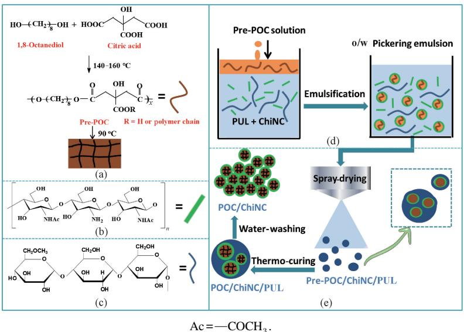  
Fig. 1 Preparation of POC-based microspheres: (a) preparation of pre-POC; (b) structure of ChiNC; (c) structure of PUL; (d) preparation of pre-POC/ChiNC/PUL o/w Pickering emulsion; (e) spray-drying of emulsion

# 1.6 Preparation of POC-based microsphere toughened CS (CS/mPOC)

The POC/ChiNC/PUL microspheres  $(0.1\mathrm{g})$  were suspended in the acetic acid solution (a mass fraction of  $2\%$ ) via ultrasonication. In this process, the shell-forming PUL was dissolved in the acetic acid solution. Subsequently,  $0.9\mathrm{g}$  CS being dissolved in the acetic acid solution was added with stirring, poured into a petri dish, and dried at  $37~^\circ \mathrm{C}$  to form the CS/mPOC film. Meanwhile, the pure CS film was prepared as control.

# 1.7 Measurement and characterization

The emulsion was transferred to a slide glass by using a micropipette, and images of droplet morphology were captured by using a YPN-330E optical microscope (Yiyuan Optical Instrument Co, China). The average droplet size was determined by measuring at least 100 individual droplets by using the ImageJ software (NIH, USA). Additionally, the morphology of the emulsion was also observed on an SU8010 field emission scanning electron microscope (Hitachi Ltd., Japan). The emulsion was first dried at room temperature, then cryo-fractured in liquid nitrogen and finally sputter coated with gold.

The morphologies of spray-dried microspheres were examined by using the SU8010 field emission scanning electron microscope after being sputter coated with gold. In addition, the POC/ChiNC microspheres were dispersed in absolute alcohol by ultra sonication and observed on a JEM-2100 transmission electron microscope (JEOL Ltd., Japan).

Uniaxial tensile tests for films were performed on a HY-941 material testing machine (Hengyu Instrument Co., China) with a  $100\mathrm{N}$  sensor at room temperature and a crosshead speed of  $10\mathrm{mm / min}$ . The results of the elastic modulus, tensile strength and strain at break were the average of at least five measurements. Additionally, the CS/mPOC film was cryo-fractured in liquid nitrogen and sputter coated with gold for cross-section observation by using the SU8010 field emission scanning electron microscope.

# 1.8 In vitro drug release

The drug-loaded POC-based core/shell structured microspheres  $(1.5\mathrm{g})$  as prepared in subsection 1.5 was suspended in  $10~\mathrm{mL}$  PBS  $\left(\mathrm{pH} = 7.3\right)$ , loaded into a dialysis bag with a molecular weight cut off of 10 000, and then immersed in a beaker containing  $20~\mathrm{mL}$  PBS, followed by low-speed stirring at room temperature. Every  $6\mathrm{h}$ ,  $4\mathrm{mL}$  PBS was taken out from the beaker to measure the absorbance at  $427~\mathrm{nm}$  for curcumin and  $269~\mathrm{nm}$  for TCH on a UV-Vis spectrophotometer (Shanghai Mapada Instrument Co., Ltd., China), respectively, and then fresh PBS  $(4\mathrm{mL})$  was replenished into the beaker. Beforehand, a serial dilution of curcumin or TCH in PBS was prepared within a range of  $2 - 100~\mu \mathrm{g / mL}$ . The linear fitting equations  $(y_{1} = 39.49x_{1} + 0.011(R_{1}^{2} = 0.999)$  for TCH and  $y_{2} = 4.79x_{2} - 0.0024(R_{2}^{2} = 0.981)$  for curcumin) were used to calculate the drug mass

concentration, respectively[31], where  $y_{1}$  and  $y_{2}$  are the corresponding absorbance of the two drugs;  $x_{1}$  and  $x_{2}$  are the corresponding mass concentrations of the two drugs. The cumulative release rate  $Q$  of each drug was calculated according to[32]

$$
Q = \left(C _ {n} V + V _ {1} \sum_ {i = 1} ^ {n} C _ {n - 1}\right) / q, \tag {1}
$$

where  $C_n$  is the solution mass concentration at the nth time,  $\mu \mathrm{g / mL}$ , determined by the standard curve method;  $V$  is the solution volume, mL;  $V_{1}$  is the sampling volume, mL;  $q$  is the total mass of each drug, g. TCH was dissolved out from the uncured microspheres by PBS and quantified via the UV-Vis spectrophotometer followed by curcumin dissolution using DMC and its quantification via the same method.

The release experiments of each sample were performed in triplicate and data were averaged. The release profiles of TCH and curcumin from microspheres were fitted by using the Ritger-Peppas model[33]:

$$
Q _ {t} = K _ {0} \times t ^ {n}, \tag {2}
$$

where  $Q_{t}$  is the cumulative release rate at time  $t$ ;  $K_{0}$  is the release rate constant;  $n$  represents the release exponent, indicating the release mechanism.

Data are expressed as mean  $\pm$  standard deviation. The one-way analysis of variance (ANOVA) was performed for comparing means between two or multiple groups, and a value of  $p < 0.05$  was considered statistically significant.

# 2 Results and Discussion

# 2.1 Analysis of o/w Pickering emulsion

The effects of the oil-phase mass fraction and ChiNC contents on the stability of emulsions were studied by observing the sedimentation behavior of the emulsion droplets after  $12\mathrm{h}$ . The results are shown in Fig. 2. The stability of the Pickering emulsion is enhanced as the mass fraction of pre-POC or the content of ChiNC increases. The diameters of emulsion droplets decrease with increasing the ChiNC content as shown in Fig. 3. The emulsion at a pre-POC mass fraction of  $50\%$  exhibits an optimal stability; when the ChiNC/pre-POC mass ratio is  $7\%$ , after  $12\mathrm{h}$ , no sedimentation occurs, and the droplet diameter decreases to  $(2.5\pm 0.9)$ $\mu \mathrm{m}$ , and it is even smaller when more ChiNC is introduced.

Therefore, in the following study, we chose a pre-POC/DMC solution (a pre-POC mass fraction of  $50\%$  ) and ChiNC at a ChiNC/pre-POC mass ratio of  $7\%$  to construct pre-POC/ChiNC/PUL o/w Pickering emulsions, in which PUL was used as protective and shell-layer material to prevent the core-layer material of pre-POC from adjoining together during subsequent thermo-curing. The results are shown in Fig.4. The introduction of PUL into the continuous water phase of the emulsions at an o/w volume ratio of  $1:4$ ,  $2:3$  and

1:1 does not disrupt emulsion stability, and even possibly makes the emulsions more stable due to the viscous effect. To further confirm the emulsion morphology, the emulsions were fully air-dried in a fume hood, after which its cross-sectional morphology was examined by using scanning electron microscopy (SEM) as shown in Fig. 4(b). There are many cavities which are supposed to be generated by emulsion droplets being pulled out during brittle fracture in liquid nitrogen, and a small quantity of protrusions is identified as the remained droplets, further confirming this point. In brief, during the evaporation of the solvents (DMC and water), PUL forms a continuous matrix and the ChiNC that wraps pre-POC droplets is immobilized in the matrix, forming a sea-island structure, indirectly proving a good stability of pre-POC/ChiNC/PUL o/w Pickering emulsions.

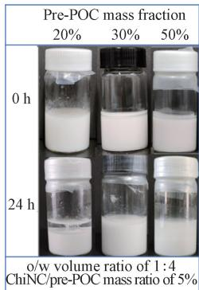  
(a)

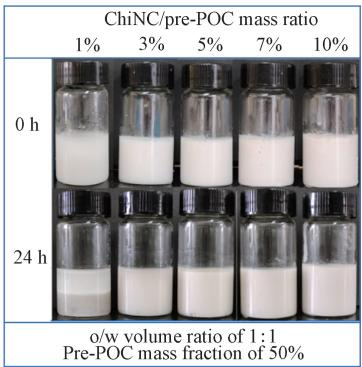  
(b)

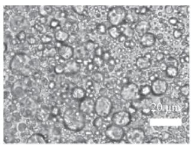

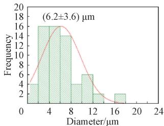  
(a)

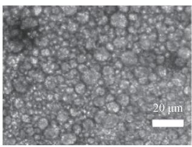  
Fig. 2 Visual photos of pre-POC/ChiNC o/w Pickering emulsions: (a) at different pre-POC mass fractions; (b) at different ChiNC/pre-POC mass ratios

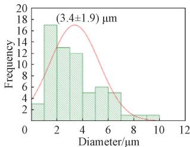  
(b)

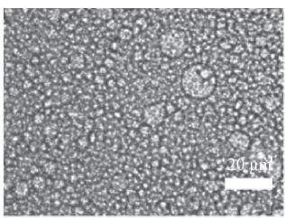

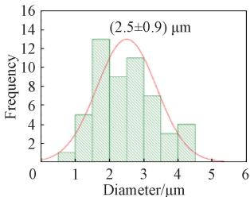  
(c)  
Fig. 3 Optical microscope images of emulsions for  $12\mathrm{h}$  and corresponding droplet diameter distribution histograms at different ChiNC/pre-POC mass ratios: (a)  $3\%$  ; (b)  $5\%$  ; (c)  $7\%$  ; (d)  $10\%$

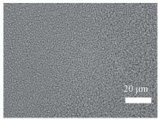

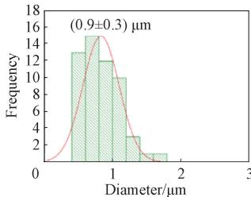  
(d)

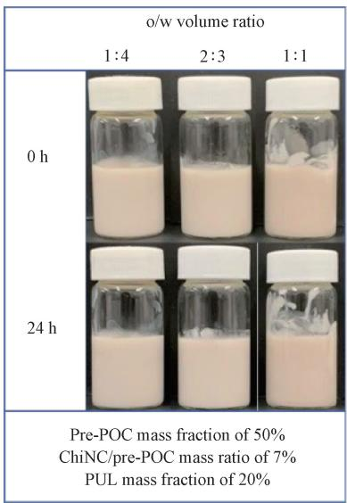  
(a)

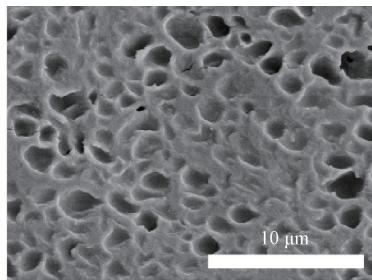

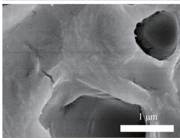  
(b)  
Fig. 4 Stability characterization of pre-POC/ChiNC/PUL o/w Pickering emulsions: (a) visual photos; (b) cross-sectional SEM images of air-dried emulsion at different magnifications

# 2.2 Analysis of POC-based microspheres

Spray-drying is a common industrial process to prepare polymer microspheres and microcapsules. Herein, the emulsion at an o/w volume ratio of 1:4 was subjected to spray-drying, followed by thermo-curing to produce POC/ChiNC/PUL microspheres. It is supposed that during spray-drying, the continuous phase of the PUL aqueous solution eventually turns into the shell layer of microspheres, the dispersed phase of the pre-POC solution eventually forms the core layer of microspheres, and ChiNCs are located between or within the two layers. It is worth noting that a dried and large microsphere might contain several smaller microspheres due to the limitation of atomization by a nozzle. During thermocuring, POC/ChiNC/PUL microspheres are formed with pre-POC translating into a crosslinked elastomer. Then, POC/ChiNC microspheres are formed by water washing to remove the shell-layer PUL. Figure 5 shows the morphologies and diameter distributions of the POC/ChiNC/PUL and POC/ChiNC microspheres. The diameter of POC/ChiNC microspheres was  $(2.0 \pm 1.1) \mu \mathrm{m}$  and lower than that of POC/ChiNC/PUL microspheres  $(3.8 \pm 1.8) \mu \mathrm{m}$  due to the removal of shell-layer PUL. Transmission electron microscopy (TEM) was also used to further confirm the microstructure of the microspheres. Figure 6(a) shows the morphologies of POC/ChiNC/PUL microspheres. There is a typical core/shell structure for the microsphere. For a larger spray-dried microsphere, there might be several smaller microspheres, i.e. forming multi-microsphere-aggregates (Fig. 6(a)). After removing PUL, POC/ChiNC microspheres with a diameter of several hundred nanometers are formed as shown in Fig.6(b). Thus, POC-based microspheres were successfully prepared by spray-drying the combined Pickering emulsion.

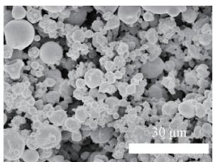

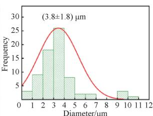  
(a)

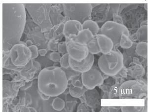

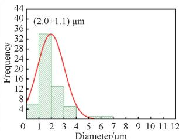  
(b)  
Fig. 5 SEM images and corresponding droplet diameter distribution histograms: (a) POC/ChiNC/PUL microspheres; (b) POC/ ChiNC microspheres

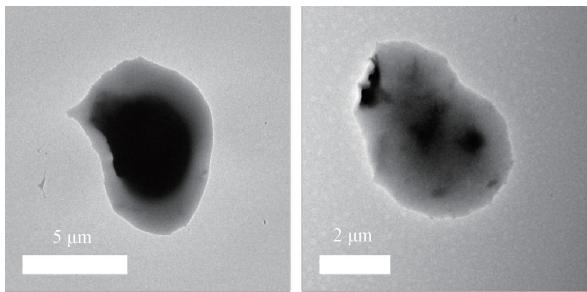  
(a)

(b)  
Fig.6 TEM images: (a) POC/ChiNC/PUL microspheres;  
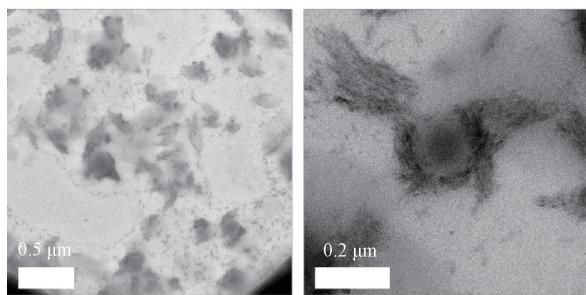  
(b) POC/ChiNC microspheres

# 2.3 Analysis of CS/mPOC films

The POC-based microspheres could be used as a class of biodegradable fillers to toughen the biodegradable polymers. We chose brittle CS as the matrix and the POC/ChiNC/PUL microspheres as the fillers to preliminarily explore the feasibility of toughing CS by using the elastomer microspheres. The water solubility of PUL would cause the multi-microsphere-aggregates to be dissociated into individual microspheres for easy blending with CS in an aqueous system. The tensile properties are depicted in Figs. 7(a) and 7(b). In comparison to the CS film, the CS/mPOC film exhibits higher tensile properties: the tensile strength increases by  $26\%$ , the strain at break increases by  $45\%$  and the elastic modulus increases by  $34\%$ . Thus, the introduction of POC/ ChiNC/PUL microspheres not only strengthens CS but also toughens CS. It has been reported that ChiNC is a good nanofiller for strengthening  $\mathrm{CS}^{[34]}$ . Meanwhile, the coexist of ChiNC and POC could strengthen and toughen CS. The cross-sectional morphology of the CS/mPOC film is displayed in Fig. 7(c). Some light-colored protrusions, identified as the microspheres, are evenly distributed in the matrix, indicating a good compatibility of CS and POC/ChiNC/PUL. In brief, it is confirmed that the POC/ChiNC/PUL microspheres enhance the tensile properties of the CS film. The potential mechanism needs to be studied in our future work.

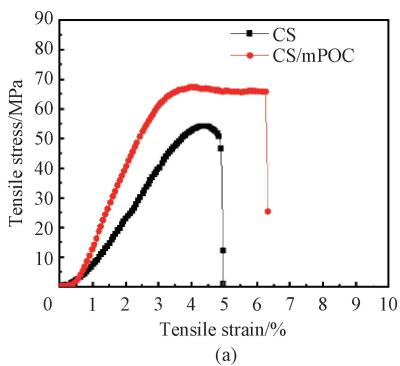  
Fig. 7 Tensile properties and cross-sectional morphology: (a) tensile stress-strain curves of CS and CS/mPOC films; (b) tensile strength, elastic modulus and strain at break of CS and CS/mPOC films; (c) cross-sectional SEM image of CS/mPOC film

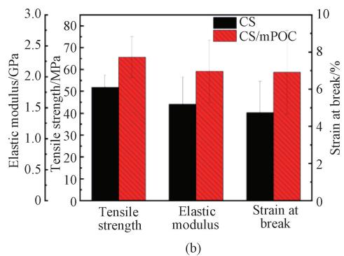

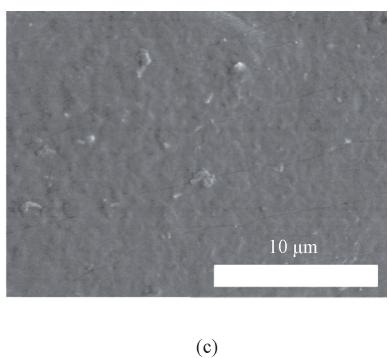

# 2.4 Drug release analysis of POC/ChiNC/PUL microspheres

Curcumin as a hydrophobic-model drug and TCH as a hydrophilic-model drug were dissolved in the oil phase and aqueous phase, respectively, to obtain drug-loaded core/shell structured microspheres via spray-drying. The cumulative release rate of each drug at time  $t$  is shown in Fig. 8. TCH in the PUL outer layer exhibits an obvious burst release in the first  $48\mathrm{h}$ , up to an cumulative release rate of  $48\%$ , and then its release gradually increases to  $99\%$  until  $480\mathrm{h}$ . Curcumin in the POC inner layer does not exhibit a significant burst release like TCH. The cumulative release rate of curcumin slowly increases at the first  $192\mathrm{h}$ , up to  $20\%$ ; then, it moderately increases at the second  $192\mathrm{h}$ , up to about  $70\%$ ; afterwards, the release is more slowly. The slow release of curcumin results from the low solubility of curcumin in the PBS solution, as well as low swelling and slow degradation of POC. Overall, the POC/ChiNC/PUL microspheres realize a double-layer drug release and dual therapeutic effects, in which the hydrophilic drug in the outer layer releases quickly and the hydrophobic drug in the inner layer releases slowly.

The diffusion mechanism of the drug release was confirmed by the Ritger-Peppas model. The fitted curves and corresponding parameters are displayed in Fig. 8.

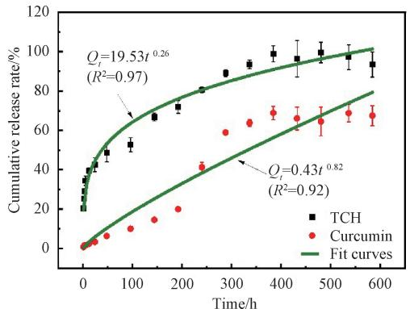  
Fig. 8 Drug release curves for drug-loaded core/shell structured microspheres

In spherical matrices, the dominant drug release

mechanism can be assumed according to the  $n$  values. For  $n \leqslant 0.43$ , the release follows the Fickian diffusion; for  $0.43 < n < 1.00$ , the release behavior is the non-Fickian transport, with erosion and diffusion as the dominant mechanism[33]. As the release exponent of TCH is 0.26 and lower than 0.43, the TCH release is mainly controlled by the Fickian diffusion; as the release exponent of curcumin is 0.82 and lower than 1.00, the curcumin release behavior is the non-Fickian transport, with erosion and diffusion as the dominant mechanism.

# 3 Conclusions

This study used the pre-POC solution in DMC as an oil phase, the PUL aqueous solution as a water phase and the ChiNC as an emulsifier to construct o/w Pickering emulsions. The stability of emulsions was enhanced with the increase of the pre-POC mass fraction and ChiNC content. With the increase of the ChiNC content, the diameters of emulsion droplets decreased. Moreover, the introduction of PUL into the continuous water phase did not disrupt the stability of emulsions. POC/ChiNC/PUL core/shell structured microspheres were successfully prepared via spray-drying. Such microspheres were used as biodegradable fillers to strengthen and toughen CS via simple aqueous mixing, i.e.  $26\%$  increase in the tensile strength and  $45\%$  increase in the strain at break. A double-layer drug release system was built to release the hydrophilic drug of TCH from the outer layer and the hydrophobic drug of curcumin from the inner layer, both roughly following the Ritger-Peppas model.

# References

[1] YANG J, WEBB A R, AMEER G A. Novel citric acid-based biodegradable elastomers for tissue engineering [J]. Advanced Materials, 2004, 16(6): 511-516.  
[2] WANG M, XU P, LEI B. Engineering multifunctional bioactive citrate-based biomaterials for tissue engineering [J]. Bioactive Materials, 2023, 19: 511-537.

[3] WAN L, LU L L, LIANG X J, et al. Citrate-based polyester elastomer with artificially regulatable degradation rate on demand [J]. Biomacromolecules, 2023, 24(9): 4123-4137.  
[4] WANG H F, HUDDLESTON S, YANG J, et al. Enabling proregenerative medical devices via citrate-based biomaterials: transitioning from inert to regenerative biomaterials [J]. Advanced Materials, 2024, 36(6): 2306326.  
[5] CHUNG E J, SUGIMOTO M, KOH J L, et al. Low-pressure foaming: a novel method for the fabrication of porous scaffolds for tissue engineering [J]. Tissue Engineering Part C: Methods, 2012, 18(2): 113-121.  
[6] BALER K, BALL J P, CANKOVA Z, et al. Advanced nanocomposites for bone regeneration [J]. Biomaterials Science, 2014, 2(10): 1355-1366.  
[7] GUO J S, TIAN X G, XIE D H, et al. Citrate-based tannin-bridged bone composites for lumbar fusion [J]. Advanced Functional Materials, 2020, 30(27): 2002438.  
[8] VOGT L, BOCCACCINI A R. Random and aligned electrospun poly(ε-caprolactone) (PCL)/poly (1, 8-octanediol-co-citrate) (POC) fiber mats for cardiac tissue engineering using benign solvents[J]. European Polymer Journal, 2021, 160: 110772.  
[9] JONES T, ZHANG B S, MAJOR S, et al. All-trans retinoic acid eluting poly (diol citrate) wafers for treatment of glioblastoma[J]. Journal of Biomedical Materials Research Part B: Applied Biomaterials, 2020, 108(3): 619-628.  
[10] GUO Y, TRAN R T, XIE D H, et al. Citrate-based biphasic scaffolds for the repair of large segmental bone defects [J]. Journal of Biomedical Materials Research Part A, 2015, 103(2): 772-781.  
[11] KIM K, JEONG C G, HOLLISTER S J. Non-invasive monitoring of tissue scaffold degradation using ultrasound elasticity imaging [J]. Acta Biomaterialia, 2008, 4(4): 783-790.  
[12] ZHANG B Y, LAI B F L, XIE R X, et al. Microfabrication of AngioChip, a biodegradable polymer scaffold with microfluidic vasculature [J]. Nature Protocols, 2018, 13: 1793-1813.  
[13] MONTGOMERY M, AHADIAN S, DAVENPORT HUYER L, et al. Flexible shape-memory scaffold for minimally invasive delivery of functional tissues [J]. Nature Materials, 2017, 16: 1038-1046.  
[14] ZHU L, ZHANG Y Z, JI Y L. Fabricating poly (1,8-octanediol citrate) elastomer based fibrous mats via electrospinning for soft tissue engineering scaffold [J]. Journal of Materials Science: Materials in Medicine, 2017, 28(6): 93.  
[15] GUO F R, LIANG K, JI Y L. Electrospun poly

(octamethylene citrate) thermoset fibrous mat from chitin nanocrystal constructed Pickering emulsion [J]. Colloid and Polymer Science, 2024, 302(6): 891-900.  
[16] WU J, MA G H. Recent studies of Pickering emulsions: particles make the difference [J]. Small, 2016, 12(34): 4633-4648.  
[17] STARVAGGI N C, BRADFORD B J, TAYLOR C D L, et al. Wettability-tuned silica particles for emulsion-templated microcapsules [J]. Soft Matter, 2023, 19(39): 7635-7643.  
[18] TU S H, ZHAO Y L, TAN H T, et al. Ultralight silica foams with a hierarchical pore structure via a surfactant-free high internal phase emulsion process[J]. Langmuir, 2018, 34(35): 10381-10388.  
[19] BON S A F, COLVER P J. Pickering miniemulsion polymerization using laponite clay as a stabilizer [J]. Langmuir, 2007, 23 (16): 8316-8322.  
[20] FADIL Y, DINH L N M, YAP M O Y, et al. Ambient-temperature waterborne polymer/rGO nanocomposite films: effect of rGO distribution on electrical conductivity [J]. ACS Applied Materials & Interfaces, 2019, 11 (51): 48450-48458.  
[21] LIsUZZO L, CAVALLARO G, MILIOTO S, et al. Pickering emulsions stabilized by halloysite nanotubes: from general aspects to technological applications[J]. Advanced Materials Interfaces, 2022, 9(10): 2102346.  
[22] SHARKAWY A, BARREIRO M F, RODRIGUES A E. Chitosan-based Pickering emulsions and their applications: a review [J]. Carbohydrate Polymers, 2020, 250: 116885.  
[23] RIGG A, CHAMPAGNE P, CUNNINGHAM M F. Polysaccharide-based nanoparticles as Pickering emulsifiers in emulsion formulations and heterogenous polymerization systems [J]. Macromolecular Rapid Communications, 2022, 43(3): 2100493.  
[24] KONG L Q, YANG H F, QIAN Z H, et al. Diradical character and controllable magnetic properties in chitin through radical modification [J]. Journal of Donghua University (English Edition), 2022, 39(1): 15-21.  
[25] LIU X F, BU Y F, JI Y L. Preparation of chitin nanowhiskers via deep eutectic solvent [J]. Journal of Donghua University (Natural Science), 2020, 46(4): 584-588. (in Chinese)  
[26] SINGH R S, SAINI G K, KENNEDY J F. Pullulan: microbial sources, production and applications [J]. Carbohydrate Polymers, 2008, 73(4):515-531.  
[27] PRAJAPATI V D, JANI G K, KHANDA S M. Pullulan: an exopolysaccharide and its various applications [J]. Carbohydrate Polymers, 2013,

95(1): 540-549.  
[28] GUERRINI L M, OLIVEIRA M P, STAPAIT C C, et al. Evaluation of different solvents and solubility parameters on the morphology and diameter of electrospun Pullulan nanofibers for curcumin entrapment [J]. Carbohydrate Polymers, 2021, 251: 117127.  
[29] LIU Y, WANG Y, ZHAO Y L, et al. Study on the properties of cyanate ester/epoxy adhesive toughened with core-shell rubber particle [J]. Chemistry and Adhesion, 2022, 44 (2): 115-117, 146. (in Chinese)  
[30] GU S H, TIAN Y L, LIANG K, et al. Chitin nanocrystals assisted 3D printing of polycitrate thermoset bioelastomers [J]. Carbohydrate Polymers, 2021, 256: 117549.  
[31] MOHAMADY HUSSEIN M A, GULER E, RAYAMAN E, et al. Dual-drug delivery of Ag-

chitosan nanoparticles and phenytoin via core-shell PVA/PCL electrospun nanofibers [J]. Carbohydrate Polymers, 2021, 270: 118373.  
[32] CAI J H, YANG Y Q, XIE S T, et al. Research on synthesis and drug release of rutin alginate/ chitosan microspheres prepared by layer-by-layer self-assembly method [J]. Polymer Bulletin, 2018(5): 58-66. (in Chinese)  
[33] LAKSHANI N, WIJERATHNE H S, SANDARUWAN C, et al. Release kinetic models and release mechanisms of controlled-release and slow-release fertilizers [J]. ACS Agricultural Science & Technology, 2023, 3(11): 939-956.  
[34] YAN W X, SHEN L B, JI Y L, et al. Chitin nanocrystal reinforced wet-spun chitosan fibers [J]. Journal of Applied Polymer Science, 2014, 131(19): 40852.

# 通过喷雾干燥甲壳素纳米晶构建的Pickering乳液制备聚柠檬酸酯弹性体微球

管裕1, 郭芙蓉2, 梁凯1*, 吉亚丽2

1. 东华大学 化学与化工学院，上海201620  
2. 东华大学 先进纤维材料全国重点实验室 材料科学与工程学院，上海 201620

摘要：聚柠檬酸酯（poly(octamethylene citrate），POC）是一种在生物医学领域具有广阔应用前景的生物弹性体材料。然而，其热固性本质使加工成型困难，特别是制备POC基弹性体颗粒以作为潜在的可降解增强填料。首先，该文以POC预聚物（pre-POC）的碳酸二甲酯溶液为分散油相，普鲁兰水溶液为连续水相，甲壳素纳米晶为颗粒型乳化剂，成功构建了Pickering乳液。其次，通过喷雾干燥乳液制备POC基核/壳结构微球，并采用扫描电子显微镜和透射电子显微镜对其进行表征。最后，将微球作为弹性体填料以提高壳聚糖膜的强度和韧性。结果表明，复合膜的拉伸强度提高了  $26\%$  ，断裂伸长率增加了  $45\%$  ；将微球作为双层药物释放系统，外层释放亲水性药物盐酸四环素，内层释放疏水性药物姜黄素，双层释放机理基本符合Ritger-Peppas模型。

关键词：聚柠檬酸酯；弹性体；喷雾干燥；微球；Pickering乳液