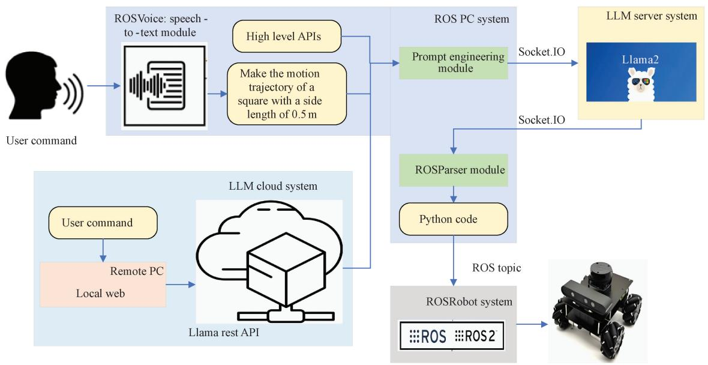
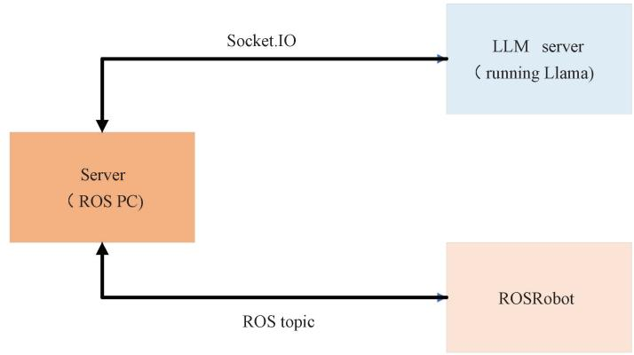
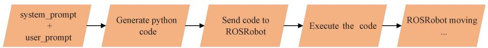
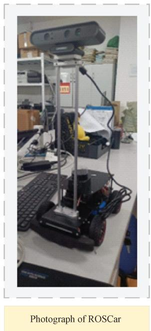
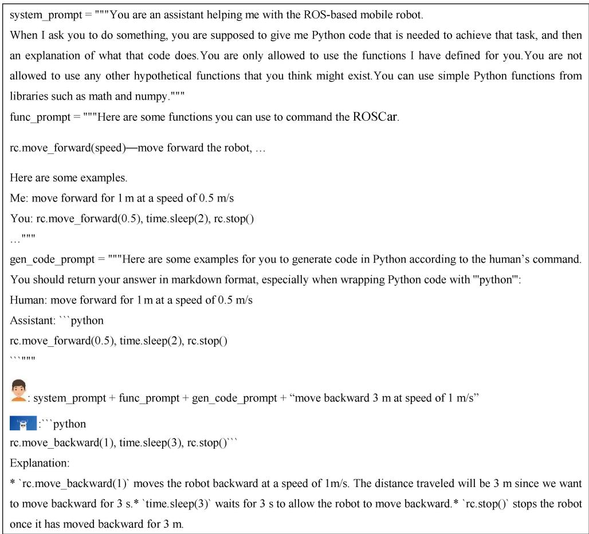
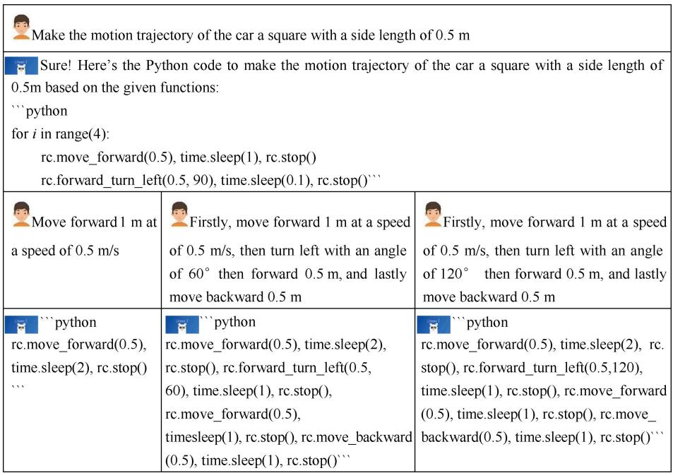
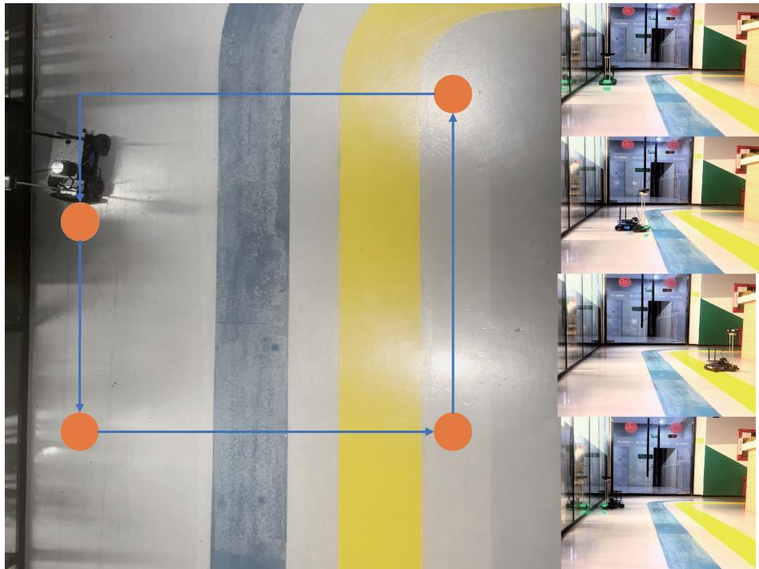
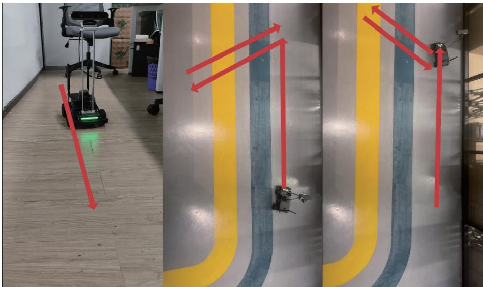
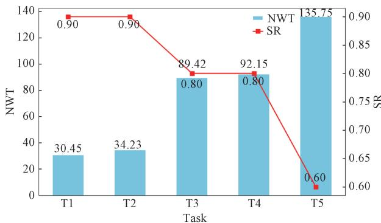
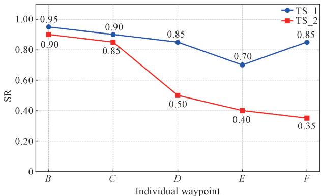

# ROSGPT: Natural Language Control of Mobile Robots Navigation via Large Language Model

HUANG Jiacui, ZHAO Mingbo∗, ZHANG Hongtao

College of Information Science and Technology, Donghua University, Shanghai 201620, China

Abstract: The objective of this work is to develop an innovative system ( ROSGPT) that merges large language models ( LLMs) with the robot operating system ( ROS), facilitating natural language voice control of mobile robots. This integration aims to bridge the gap between humanrobot interaction ( HRI) and artificial intelligence ( AI). ROSGPT integrates several subsystems, including speech recognition, prompt engineering, LLM and ROS, enabling seamless control of robots through human voice or text commands. The LLM component is optimized, with its performance refined from the open-source Llama2 model through fine-tuning and quantization procedures. Through extensive experiments conducted in both real-world and virtual environments, ROSGPT demonstrates its efficacy in meeting user requirements and delivering user-friendly interactive experiences. The system demonstrates versatility and adaptability through its ability to comprehend diverse user commands and execute corresponding tasks with precision and reliability, thereby showcasing its potential for various practical applications in robotics and AI. The demonstration video can be viewed at https: / / iklxo6z9yv. feishu.cn/ docx/ Lux3dmTDxoZ5YnxWJTZcxUCWnTh.

Keywords: Llama2 model; large language model ( LLM); automatic speech recognition ( ASR); human-robot interaction (HRI); robot operating system (ROS); Habitat simulator

CLC number: TP 391. 4

Document code: A

Article ID: 1672-5220(2025)03-0315-15

Open Science Identity (OSID)


# 0 Introduction

In recent years, the emergence of large language models ( LLMs), particularly the robust capabilities of ChatGPT[1-2] , has revolutionized the landscape of humanrobot interaction ( HRI). With LLMs being increasingly leveraged in various domains their integration into robotics has led to significant advancements in autonomous systems’ comprehension of human language and their ability to interact with humans[1, 3] . Concurrently, embodied intelligence[4] has seen rapid development and real-world applications, as demonstrated

by companies organizations such as Figure AI and Tesla, as well as domestic projects like Agibot. These endeavors aim to fuse LLMs with humanoid robots, empowering them with enhanced language understanding, environmental perception and friendlier interactions with humans. This convergence marks a significant shift toward more advanced, user-centric robotic solutions, bridging the gap between artificial intelligence ( AI) and practical, real-world applications. In light of this burgeoning trend, we are also committed to deeply integrating LLMs with robotics aiming to achieve a more amicable HRI. This endeavor holds profound significance for the future development and practical deployment of embodied intelligence.

With the development of LLMs, prompt engineering becomes crucial. Crafting precise prompts guides LLMs to effectively tackle complex tasks, attracting attention to the potential of these LLMs across diverse applications[5] . Researchers refine prompts to optimize LLM performance, spanning natural language understanding to problem-solving. Giray[6] summarized and outlined the fundamental principles of prompt engineering based on LLMs. White et al.[7] developed a catalog of prompt patterns to address common issues encountered when conversing with LLMs, aiming to enhance the automation of software development tasks through improved interactions with LLMs. Their work outlines the fundamental principles of prompt engineering, providing a structured approach to crafting effective prompts that customize and refine the capabilities of LLMs like ChatGPT. Chen et al. [8] advanced the field of prompt engineering by introducing LLaMA-LoRA, a sophisticated framework that enhances the comprehension and reasoning capabilities of Chinese language models. The above groundbreaking work offers great inspiration for future research. However, these efforts lack systematic focus on specific scenarios, particularly in terms of physical implementations. In contrast, our work on robot interaction aims to build on these foundations in real-world applications and make some pioneering contributions.

Many current research efforts are based on ChatGPT. Despite its superior accuracy and corresponding speed, its closed-source nature inhibits extensive fine-tuning for better adaptation to specific scenarios[9-10] . Currently, there is also a significant amount of research being conducted on Llama2[10] . Code Llama[11] endeavors to advance the field of programming by offering a range of LLMs tailored for various programming tasks showcasing state-of-the-art performance across multiple code benchmarks. Xu et al. [ 12] successfully fine-tuned the Llama2 model by using their own dataset, achieving outcomes that better met their specific requirements. The aforementioned efforts were built upon the open-source Llama2 model and optimized to better adapt to specific work scenarios. This not only showcases the unique appeal of open-source LLMs but also guides our work in the right direction. Although Code Llama performs well in programming tasks, in our specific scenario, we have undertaken extensive prompt engineering efforts, which result in the need for the model to comprehend lengthy background information. This requires the model to possess strong abilities in long-text comprehension, contextual understanding and memory retention. Code Llama still falls short in these aspects. Therefore we select the Llama2 model as our base model.

As mentioned above how to integrate LLMs with specific tasks for robots is a key problem in real-world applications. The following work provides us with some ideas. In Ref. [ 3], the authors leveraged ChatGPT to interpret natural language inputs and generate structured JSON-formatted commands, enabling precise robot control and enhanced human-computer interaction. However in ChatGPT for Robotics the authors directly fed human natural language commands and the application programming interfaces ( APIs) of high-level function libraries implemented by the robot to ChatGPT[1] . The intention was to enable the LLMs to understand human instructions while also comprehending the APIs directly invoking these APIs to obtain Python code that directly controls the robot s movements. The experiments confirmed that this approach yielded better implementation results. Grumeza et al.[13] investigated the utilization of the Llama2 model to enhance social interactions with the SoftBank Robotics Pepper robot in an academic setting. They aimed to improve the robot s ability to engage with humans by offering guidance and information, particularly focusing on addressing limitations in Pepper’ s language processing capabilities. This research innovatively leveraged Meta Llama2, an education-focused LLM to improve speech-to-text conversion. By enhancing Pepper’ s understanding and responsiveness to human queries it advanced the

practical implementation of cloud-edge collaborative robotics in social scenarios. Although the above research has achieved robot control based on LLMs, they are all focused on interactive control in simulation environments. Implementing this type of control on real machines poses significant challenges, yet our work has successfully achieved this goal.

In summary the main focus of this research is the optimization of Llama2 to enable natural language-based interaction with robots. To enhance user experience, we incorporate a speech-to-text module for natural language control and add LLM cloud functionality to enable webbased control. The main innovations of our work are as follows.

1) Leveraging the robot operating system ( ROS), we develop ROSRobot, a comprehensive set of high-level function libraries for robots, to enable advanced interaction control through LLMs   
2) Innovative prompt engineering efforts enable the model to directly output Python code capable of controlling ROSRobot, leading to the conceptualization of ROSGPT.   
3) Integrating speech-to-text and cloud functionalities into the model enables users to effectively control robots using natural language, without being limited to local servers. Additionally it facilitates web-based control of robot actions, offering limitless possibilities for future innovation.

# 1 Materials and Methods

The system architecture of ROSGPT is shown in Fig. 1. As depicted in Fig. 1 ROSGPT consists of four main systems: the ROS PC system, the LLM server system, the ROSRobot system and the LLM cloud system. The ROS PC system serves as the core of ROSGPT and includes three key modules the speech-totext module, the prompt engineering module and the ROSParser module. The speech-to-text module is responsible for recognizing human speech and converting it into text. The prompt engineering module then processes the text commands from the speech-to-text module, combining them with a custom high-level function library. These are passed to the Llama2 model via APIs. The output from Llama2 is parsed into the Python code for controlling robot motion through the ROSParser module. The robot then executes this code using either ROS or ROS2, where ROS2 is the newer version of this robotic. Additionally the LLM cloud module enables remote control via APIs and a public web address. We built the ROSRobot based on the ROS platform and users can issue voice or text commands to control the robot remotely achieving the same level of control as local operation.

  
Fig. 1 System architecture of ROSGPT

# 1. 1 Workflow design

Using Llama2 for robotics control presents various obstacles, including ensuring comprehensive and precise problem descriptions identifying suitable function calls and APIs, and structuring responses with appropriate biases. To maximize the utility of Llama2 for robotics applications, we established a sequential workflow consisting of the following steps.

1)Firstly, based on the underlying control principles of the robot and the principles of ROS-based control, we designed a powerful high-level function library. This library offers a rich set of APIs for easy invocation.   
2 ) Secondly, we established role definitions, incorporating the functionalities and parameter meanings of the aforementioned APIs into Llama2. Additionally, we provided detailed descriptions of the tasks that Llama2 needs to accomplish along with specific examples. This ensures that Llama2 can generate precise Python code to control robot actions according to user commands.   
3)Thirdly, the user remained actively engaged in the process evaluating the code output by Llama2 either through direct analysis or simulation, and subsequently provided feedback on the quality and safety of the generated code. Additionally, it is worth noting that the code returned by Llama2 is sometimes not clean Python code. It may contain explanatory statements that cannot be dynamically executed on the robot’ s end. Therefore, we utilized ROSParser to extract clean code from Llama2’s output.   
4 Lastly the Python code was transmitted to the robot via the ROS topic and dynamically executed within the robot using the exec function in Python.

# 1. 2 Fine-tuning and quantization of Llama2

Llama2 is a collection of pre-trained and fine-tuned generative text models ranging from 7 billion to 70 billion parameters[9] . In contrast to the base Llama2 model[10] ,

in our scenario we require the LLM to excel in comprehending lengthy texts and understanding the contextual connections between different dialogues. Additionally, it needs to possess strong coding capabilities. Therefore, we need to perform specific fine-tuning on the LLM regarding its long-text comprehension and coding abilities. Furthermore, due to our limited computational resources and the necessity for the LLM to have a relatively fast inference speed in our environment, we also need to quantify the LLM to a certain extent. We have optimized the Llama2 model based on the relevant work of LLaMA-LoRA[ 8] and LLaMA-Adapter[ 14] . These optimizations involve refining its architecture to better suit our specific requirements, particularly in enhancing its ability to comprehend lengthy texts and improve contextual understanding between different dialogues. To enhance the programming capabilities of the LLM, we incorporated the weights from the Code Llama2[ 11] model as pre-training model weights. By integrating the meta-trained model parameters from official training into our model, we aimed to augment its coding proficiency. This approach allowed us to leverage the specialized expertise encoded within the Code Llama model and seamlessly integrate it into our framework, thereby enriching the programming capabilities of the LLM.

In the fine-tuning and quantization of models the two mainstream technical approaches are quantizationaware low rank adapter QLoRA [15] and GPTQ[16] . QLoRA adopts the NormalFloat type and further quantizes the scaled data after quantization. GPTQ quantizes each parameter within a certain block one by one. After each parameter is quantized, it is necessary to appropriately adjust the other unquantized parameters within this block to make up for the accuracy loss caused by quantization.

The idea of GPTQ originally came from the optimal brain damage (OBD) algorithm proposed by Lecun et al.[17] in 1989. Through continuous optimization of multiple algorithms, GPTQ was finally obtained. It has rigorous mathematical theoretical derivations, and all algorithm steps are theoretically supported. Relatively speaking, QLoRA is slightly inferior in this aspect. Therefore, we used GPTQ to conduct the fine-tuning and quantization of Llama2. By applying GPTQ, we effectively reduced the computational complexity of the model, enabling it to achieve an accelerated inference speed without compromising the accuracy. This optimization strategy proved instrumental in meeting our computational constraints while maintaining high performance. By refining the optimal brain quantizer (OBQ) approach[18] , GPTQ quantizes all rows simultaneously instead of in a greedy order. The essence of GPTQ lies in three main steps. 1 ) It ensures similar error outcomes with significantly reduced runtime, particularly for large layers. 2) It optimizes graphics processing unit ( GPU) utilization by processing columns in blocks and updating matrices incrementally. This strategy effectively addresses the memory-throughput bottleneck, providing significant speedup for very large models. 3) To address numerical inaccuracies, especially with block updates the method precomputes row information using Cholesky decomposition. This ensures numerical stability and enhances robustness and speedup for large models.

# 1. 3 Building design of communication mechanism

The communication mechanism of ROSGPT is shown in Fig. 2. It is primarily based on two key technologies: ROS topic and Socket. IO. ROS topic operates on a publish-subscribe model within the ROS framework, enabling nodes to publish messages to topics

for other nodes to subscribe to, facilitating flexible and asynchronous communication between nodes for data sharing and robot control. Socket. IO is a real-time communication protocol built on WebSocket, providing event-driven bidirectional communication for seamless integration of interactive features in web applications.

As depicted in Fig. 2, the above scenario primarily includes three devices: ROSRobot, ROS PC and LLM server. The ROSRobot, also known as ROSCar, is an intelligent robot car equipped with a ROS operating environment and designated as the master node in ROS. The ROS PC refers to an operating system configured with a ROS environment where the non-large model part of ROSGPT’s code also runs. The LLM server, being a high-computational-power server, is capable of running the Llama2 model. Communication between the ROS PC and the ROSRobot is achieved via ROS topic while the ROS PC and the LLM server communicate through Socket. IO. Firstly on the ROS PC user commands and system prompts incorporating model role settings and advanced APIs are sent via Socket. IO to the LLM server. The Llama2 model runs on this server, inferring based on the prompt to generate output. The generated output is then sent back to the ROS PC. The ROSParser ( Fig. 1) on the ROS PC parses Llama2’s response to generate executable Python code. At this point a manual decision is made on whether to send the command to the ROSCar for execution. On the ROSCar side, the system enters a blocking phase waiting to receive commands from the ROS PC. Once interrupted, it dynamically executes the code using Python’ s exec mechanism and re-enters the blocking state to await the next command. Furthermore, we utilize technologies like Gradio[19] for web-based visualization and control enabling remote control via the Internet.



  
Fig. 2 Communication mechanism of ROSGPT

# 1. 4 Implementation of voice control

To achieve more personalized interaction, we incorporated elements of the open-source Wukong Robot project into our system, enhancing the user’ s experience with voice control. As depicted in Fig. 3, the user’s voice input is fed into the ROSVoice robot, where it undergoes speech recognition via the automatic speech recognition

(ASR) engine, followed by semantic understanding through the natural language understanding ( NLU ) engine. Subsequently, the text-to-speech (TTS) engine synthesizes new speech, which is then output as synthesized control speech. The ASR and TTS functionalities are primarily implemented by utilizing APIs from companies such as Baidu, iFlytek, Tencent and Alibaba.

  
Fig. 3 System architecture of ROSVoice robot

# 1. 5 Proofreading of generated code

Although we have done a great deal of work to maximize the generation of accurate robot control codes by LLMs, in most cases, the text returned by LLMs cannot be directly transmitted to the robot for immediate operation. Instead, further processing and inspection are required to ensure the accuracy of the final executed actions. Therefore we designed the ROSParser module whose core function is to ensure that the final output code is accurate and clean robot control code. This module is mainly divided into three steps. The first step is to perform regular expression matching on the text returned by the LLM through the regularization method, extract the robot control code, and remove the irrelevant explanatory text. The second step is to use the LLM again to further check the legality of the code, including the grammar, logic of the code, and whether there are inappropriate parameters. The last step is to display the code on the front-end interface for the user to conduct the final inspection. Only after the user clicks to confirm will the control code be executed by the robot.

# 2 Results and Discussion

# 2. 1 Setup environment

# 2. 1. 1 Building Habitat simulation environment

Simulation plays a crucial role in research by serving as a means for experimentation validation and functionality verification. It accelerates the development process, reduces trial-and-error costs, and represents a valuable research methodology. Thus we constructed a simulation environment based on Habitat and cmu-

exploration. Cmu-exploration, an autonomous exploration development environment that integrates the task-aware robot exploration ( TARE ) algorithm, is designed for system development and robot deployment in ground-based autonomous navigation and exploration[20-21] . It contains a variety of simulation environments, autonomous navigation modules such as collision avoidance terrain traversability analysis and waypoint following, and a set of visualization tools. Users can develop autonomous navigation systems and later on port those systems onto real robots for deployment. Habitat simulator[22] is a flexible and highperformance three-dimensional ( 3D ) simulator with configurable agents, multiple sensors and generic 3D dataset handling (with built-in support for MatterPort3D, Gibson, Replica and other datasets). We established an interactive data collection platform using the cmuexploration and Habitat simulator, enabling a controlled and interactive data-gathering solution in a virtual environment. The fundamental implementation process is depicted in Fig. 4. Users utilize the integrated development environment s joystick and visualization tools to set waypoints based on the changes in the robot s environment in cmu-exploration. These waypoints undergo a series of operations, including local planner, terrain analysis and waypoint following. The generated control commands for the robot are then used in the ROS platform[23] to control the motion of the robot agent, enabling interactive control by humans. Within the ROS framework, “ topic: pose ” transmits the real-time pose information while topic rgbd streams the color and depth information. The pose information of the robot agent is sent through the ROS platform to the Habitat simulator.

  
Fig. 4 Simulation built on Habitat

# 2. 1. 2 Building ROS-based robot

Our ROSCar is equipped with the Jetson Nano embedded computing platform, providing powerful deep learning capabilities. The physical photo and software framework diagram of ROSCar are shown in Fig. 5. In terms of sensors we utilize the Orbbec Astra Pro Plus monocular depth camera, capable of capturing the color and depth information, as well as the Slamtec E300 Lidar, enabling point cloud acquisition. The software framework of ROSCar primarily consists of three layers the driver layer, the middleware layer and the application layer. The

driver layer controls the electrical machinery, encoders, inertial measurement units ( IMUs), battery levels, etc., by using embedded software ( FreeRTOS[24] ). The middleware layer, developed based on the ROS platform, communicates with the driver layer to obtain low-level sensor information via serial communication. In the middleware layer, we use the unified robot description format(URDF) model. The application layer builds upon the middleware layer to deploy and apply various deep learning algorithms such as simultaneous localization and mapping (SLAM) and navigation.



  
Fig. 5 Photograph and software framework diagram of ROSCar

# 2. 2 API design and prompt engineering

# 2. 2. 1 High-level functions for ROSRobot

In the control of ROSRobot we primarily utilize the geometry_msgs package in ROS to achieve basic control. Geometry _ msgs is a message type in ROS used to describe geometric information of robots, such as position, velocity and acceleration. The twist message type is a subtype of geometry_msgs, specifically used to describe the linear and angular velocities of a robot. It consists of a linear component of type Vector3 and an angular component also of type Vector3, representing the linear and angular velocities of an object, respectively.

Specifically, the linear velocities represent the velocities along the x, y and z axes, measured in meters per second while the angular velocities represent the rotational velocities around the $x$ , $y$ and z axes, measured in radians per second. By passing the correct messages to the underlying driver of the ROSRobot, control of the robot can be achieved. Our API design involves encapsulating different twist messages required for different actions. The specific APIs can be referenced in Table 1. The Llama2 model needs to comprehend the following APIs, utilizing user commands to call them appropriately and provide the correct parameters.

Table 1 List of high-level functions   

<table><tr><td>High-level function</td><td>Function description</td></tr><tr><td>move_forward (speed)</td><td>Move forward the robot</td></tr><tr><td>move_backward (speed)</td><td>Move backward the robot</td></tr><tr><td>forward_turn_left (speed, angle)</td><td>Make the robot turn left while moving forward</td></tr><tr><td>forward_turn_right (speed, angle)</td><td>Make the robot turn right while moving forward</td></tr><tr><td>backward_turn_left (speed, angle)</td><td>Make the robot turn left while moving backward</td></tr><tr><td>backward_turn_right (speed, angle)</td><td>Make the robot turn right while moving backward</td></tr><tr><td>stop()</td><td>Stop the robot</td></tr><tr><td>sleep(t)</td><td>Delay for t; input parameter t is a float number</td></tr><tr><td>move_to(x, y)</td><td>Move the robot to the specified position, which consists of two parameters corresponding to the x and y coordinates. When using the function, the current coordinate is considered to be (0, 0)</td></tr></table>

# 2. 2. 2 Clear description of prompt engineering

To ensure the Llama2 model accurately completes the tasks we specify, we need to provide specific and clear prompts as shown in Fig. 6. Vemprala et al.[1] have proposed some basic principles regarding the prompt engineering of LLMs in robots. Inspired by this work, we propose the following groundbreaking principles in combination with the practical application of robots in real-world scenarios.

1) Constraints and requirements. We constrain the

model’s output by enforcing a series of specific requirements to ensure that the model’s output falls within the predefined norms.

2 Callable APIs and their descriptions. We need to inform LLMs of the callable APIs along with their specific functionalities and parameter meanings, enabling high-level programming on the APIs we implement.   
3)Solution examples. We also need to provide rich learning examples, such as scenarios where a given user input corresponds to the expected model output.

  
Fig. 6 Structured prompt engineering pipeline for ROSCar control

# 2. 3 Zero-shot task with ROSRobot

To validate the performance of the ROSGPT model, we conducted experiments on the ROSRobot. Due to computational constraints, our navigation experiments and the execution of Llama2 are conducted on separate servers. Llama2 operates on a server equipped with two NVIDIA RTX 3090 GPUs. As for the ROS PC experiment, our experimental setup comprises an Intel Core i7-8700 CPU running at $3 . 2 0 \ : \mathrm { G H z }$ , accompanied by an NVIDIA GeForce RTX 2080 Ti with 12 GB VRAM, and featuring 12 threads. We initially verified the effectiveness of text-to-programming by conducting

multiple experiments. By varying parameters such as motion command, speed, distance and angle, we consistently obtained satisfactory model outputs. Subsequently, we integrated a speech module to directly control the motion of the ROSRobot through voice input. The transition from speech to text commands yielded excellent results, and subsequent control actions produced motion trajectories consistent with the voice commands. Figure 7 illustrates representative examples of natural language commands and their corresponding generated code, validating ROSGPT’ s ability to translate diverse motion tasks into executable trajectories.

  
Fig. 7 Code generated by ROSGPT for path planning tasks and corresponding execution results

The main steps of our experiment are as follows.

1) We built the ROSRobot based on ROS and designed and implemented an advanced PAI for controlling the robot.   
2 ) We conducted extensive prompt engineering efforts specifically for controlling the ROSRobot, and enabled the LLM to accurately generate Python code based on user inputs.   
3 We designed a communication architecture within the same local area network ( LAN) that facilitated the transmission of user commands to the actual robot and provided a user-friendly interface.   
4 We designed five different tasks to validate the experimental results, specifically as follows, where the code in parentheses serves as the abbreviation for each respective task.

a) Move forward (T1).   
b) Move backward (T2).   
c) Move forward, turn left $1 2 0 ^ { \circ }$ , move backward (T3).   
d) Move forward, turn left $6 0 ^ { \circ }$ , move backward

e) Move in a square trajectory (T5).

The specific scenarios are illustrated in Figs. 8 and 9. Users input control commands for the ROSCar through the web interface designed for user interaction. The commands are then transmitted to Llama2 for inference. The resulting code from the inference is parsed and then transmitted via ROS topic communication to the ROSCar. The ROSCar can dynamically execute the Python code output by the model. Figure 8 illustrates the ROSCar moving along a square trajectory (corresponding to T5). Figure 9 ( left ) shows the trajectory of the ROSCar moving forward with the red arrow indicating the path of the robot. Figure 9 ( middle) illustrates the ROSCar’ s path when it first moves forward, then turns left by $1 2 0 ^ { \circ }$ , continues moving forward and finally back to its original starting point before the left turn ( corresponding to T3) . Figure 9 (right) demonstrates the ROSCar’s path when it first moves forward, then turns left by $6 0 ^ { \circ }$ , continues moving forward, and finally back to its original starting point before the left turn (corresponding to T4).

  
Fig. 8 Movements of ROSCar along a square trajectory

  
Fig. 9 Movements of ROSCar according to specified commands

For the above experiments, we primarily evaluated the ROSCar s normalization walking time NWT and success rate (SR). The experimental results are shown in Fig. 10. As the complexity of the tasks increases the SR gradually declines but remains above 0. 6 overall. This indicates that our system can operate relatively stably, and the model can complete user instructions to a satisfactory extent. Additionally, the bar chart shows the NWT of different tasks. It can be observed that as the complexity of the tasks increases the time taken to complete the tasks also increases. Among the tasks T5 needs a significantly longer NWT due to its more complex task description which requires the invocation of more advanced APIs.

  
Fig. 10 NWT and SR of ROSCar in different tasks

# 2. 4 Zero-shot task in Habitat

In the virtual environment we have constructed a virtual clothing store environment based on the 5q7pvUzZiYa dataset in the Matterport3D dataset and performed 3D environment reconstruction and natural language navigation through the Habitat simulator. As shown in Fig. 11 we set six waypoints $( A , B , C , D , E$ and $F$ during the simulation experiment. Point $A$ is the starting point of the mission, and point $F$ is the end point. To enable the robot to smoothly navigate from one

waypoint to another, firstly, the $\mathbf { A \Phi ^ { * } }$ algorithm[25] , a heuristic search method that finds the shortest path, is used to find the shortest path between two waypoints. Then, the LLM is utilized to conduct dynamic programming in combination with the provided API and the route obtained by the $\mathbf { A } ^ { * }$ algorithm. Specifically, the navigation route is segmented, and motion instructions are generated for each short route. Finally, the verified correct code is transmitted to the simulated robot for execution and visual rendering effects.

  
Fig. 11 Robotic task execution in a virtual clothing store via human voice commands

Firstly, we predefined six waypoints labeled A, B, C, D, E and $F$ in our system, requiring the robot to navigate to specific points based on the user s natural language descriptions. We designed two experiments. In the first experiment the user provides instructions to guide the robot to each waypoint sequentially (simulation task 1 TS _ 1 which is relatively simple. In the second experiment the user describes the entire task to the robot at once, and the LLM needs to navigate to all waypoints in sequence simulation task 2 TS _ 2 . This experiment assesses the model ’ s long-horizon planning capabilities.

Our experiment begins by manually guiding the robot to waypoint A where it waits for the user s initial control input. In TS_1, upon receiving the user ’ s instruction, the robot proceeds to the designated waypoint and subsequently remains poised for subsequent commands. This iterative process continues until the robot has successfully traversed all predefined waypoints, thereby concluding the task. Under TS _1 if the robot encounters a significant error, the user can intervene and manually control the robot to reach the specified waypoint, ensuring that subsequent tasks can proceed uninterrupted. In TS_2, the user inputs a description of the movement process through all waypoints in one go, and the model outputs the Python code to control the robot’s movements. For potential unexpected situations,

such as the robot significantly deviating from its current target or getting stuck in a corner, the user can forcibly stop the robot. However, if the robot merely skips a waypoint due to not being close enough to the target, no intervention is required.

The experimental results in the virtual clothing store scenario ( Fig. 12 ) illustrate the navigation SRs of the robot at waypoints $B$ to $F$ under two task settings ( TS _ 1 and TS _ 2 ) . In TS _ 1, the SR is generally high and stable, indicating that step-by-step interactive control contributes to improved navigation stability and execution accuracy. In contrast, TS _ 2 exhibits a progressive decline in the SR as the task proceeds, with notably poor performance at waypoints $E$ and $F$ . This suggests a significant performance degradation in long-horizon tasks. The discrepancy is primarily due to TS_2 relying on a single-shot planning strategy, which lacks intermediate correction mechanisms leading to the accumulation of errors over time. Additionally the latter segments of the path often involve more complex spatial configurations, posing greater challenges for the model ’ s spatial reasoning and action sequence generation. Overall, while the model performs well in short-horizon tasks, its robustness and adaptability remain limited in long-horizon scenarios, particularly in terms of dynamic planning and action generation.

  
Fig. 12 SR of different waypoints in the simulation environment

# 3 Comparative Experiments and Ablation Studies

# 3. 1 Comparative experiments of API-based and JSON-based schemes

Regarding the design schemes of feature engineering for robots, there are currently two mainstream approaches. One is the scheme of standardizing JSON data formats JSON-based adopted by Koubaa et al.[3] . The other is the scheme of dynamic programming based on APIs (API-based) that we designed by referring to the work of Vemprala et al.[1] . To verify the superiority of our scheme, we carried out comparative experiments.

In the JSON-based work[3] the LLM is required to return a standard JSON-format text, and the control of the robot is achieved by parsing the JSON data. We simulate the basic movements of the robot by using keyboard control, and the JSON format is set as follows.

```json
{
    "action": "control",
    "params": {
        "key": <string],
        "speed": <number],
        "turn": <number>
    }
    "distance": <number>
} 
```

The default value for “action” is “ control”; “ key” can only be one of the characters, namely k, i, j, <, l, u, o, m, >, q, z, w, x, e, c; “ speed” is a floating point number and the default value is 0. 5; “ turn” is a floating point number and the default value is 2. 0 “distance ” is a floating point number and the default value is 0. 5, the unit is meter, and if it is not in the prompts, then convert it to meters. In addition, the corresponding relationship between “key” and the natural language description of the RobCar s actions is as follows.

k: stop   
i: forward   
j: turn left   
< backward   
l: turn right   
u forward and turn left   
o: forward and turn right   
m: back and turn left   
$>$ : back and turn right   
q: increase the maximum speed by $10 \%$   
z: reduce the maximum speed by $10 \%$   
w: only increase the linear speed by $10 \%$   
x: only reduce the linear speed by $10 \%$   
e: only increase the angular velocity by $10 \%$   
c: only reduce the angular velocity by $10 \%$

For the above two schemes we conducted comparative experiments of the five tasks T1 - T5 in Section 2. 2. The prompt architecture schemes of the two experiments are different and the modules related to the prompt engineering are adapted accordingly. However, the consistency of variables such as the hardware platform and experimental environment is maintained to ensure effective control of variables. For each task, we conducted 10 experiments in both schemes. Taking the final experimental SR as the ultimate evaluation indicator, the obtained experimental results are shown in Table 2.

Table 2 SR of different tasks under JSON-based and API-based schemes   

<table><tr><td rowspan="2">Scheme</td><td colspan="5">SR</td></tr><tr><td>T1</td><td>T2</td><td>T3</td><td>T4</td><td>T5</td></tr><tr><td>JSON-based</td><td>0.90</td><td>0.80</td><td>0.70</td><td>0.80</td><td>0.10</td></tr><tr><td>API-based (ours)</td><td>0.90</td><td>0.90</td><td>0.80</td><td>0.80</td><td>0.60</td></tr></table>

From the above experimental results, it can be seen that the designed API-based scheme has a high SR for relatively simple tasks T and T . For the more complex tasks T3 - T5, although the SR has decreased, the tasks can still be completed. In contrast, the JSON-based scheme has a relatively high SR when the tasks are simple, but the SR drops significantly in complex tasks,

especially for T5. Thus, it can be concluded that our scheme has a certain superiority.

# 3. 2 Ablation studies of high-level functions and prompt engineering module

As shown in Table 1, we encapsulate the commonly used running states of the robot to obtain high-level functions. These functions are derived from some low-

level twist libraries. The twist libraries provide precise control interfaces for various parameters of the robot. If the low-level APIs are directly used, a more precise control effect can be achieved, but it increases the difficulty for LLMs to understand complex APIs and carry out complex programming based on them. To verify whether the high-level functions that we designed can significantly improve the final control effect while ensuring comparable control precision, we conducted ablation experiments on the functions of this module. The ablation experiments were conducted specifically on the high-level APIs and prompt engineering modules within the original pipeline, aiming to explore the roles of these two modules within the overall system. For the high-level APIs the original experiment fed our designed control APIs ( Table 1 ) into the prompt engineering module, whereas in the ablation experiments, we sent the low-level

APIs prior to encapsulation directly into the subsequent modules. Regarding the prompt engineering module the original experiment leveraged the system prompt as a basis and incorporated user input for inference. In contrast, the ablation experiments directly passed the user input and APIs into the Llama2 model for inference. We conducted the ablation experiments on the ROSRobot platform.

The results of the ablation experiments are shown in Table 3, where PE represents the prompt engineering module w / o indicates the removal of that module and high and low represent high-level APIs and low-level APIs, respectively. As can be seen from Table 3, both the prompt engineering and high-level APIs play a positive role in the system, with the high-level APIs exhibiting a particularly significant effect. In complex tasks, the SR without the prompt engineering module is very low.

Table 3 Ablation experimental results   

<table><tr><td rowspan="2">Experimental setup</td><td colspan="5">SR</td></tr><tr><td>T1</td><td>T2</td><td>T3</td><td>T4</td><td>T5</td></tr><tr><td>High + with PE</td><td>0.90</td><td>0.90</td><td>0.80</td><td>0.60</td><td>0.60</td></tr><tr><td>High+ w/o PE</td><td>0.60</td><td>0.65</td><td>0.40</td><td>0.35</td><td>0.20</td></tr><tr><td>Low + with PE</td><td>0.40</td><td>0.45</td><td>0.20</td><td>0.15</td><td>0.10</td></tr><tr><td>Low + w/o PE</td><td>0.40</td><td>0.35</td><td>0.10</td><td>0.05</td><td>&lt;0.05</td></tr></table>

# 4 Conclusions

This research introduces ROSGPT, a system enabling robot control based on human natural language or voice commands to accomplish specific tasks. It successfully integrates LLMs with robots expanding the application scope of LLMs and contributing to the advancement of embodied intelligence. In real-world scenarios we achieve end-to-end control from natural language to robot task completion, while in virtual environments, we demonstrate effective interaction.

However, this research still has some limitations. The inference capability of Llama2 lags behind state-ofthe-art LLMs like GPT4 and Llama3, resulting in occasional instability in ROSGPT’ s output, necessitating manual judgment and filtering. Furthermore, our efforts in robot perception are relatively limited, resulting in constrained environmental awareness for embodied robots and the tasks accomplished by ROSGPT still exhibit significant gaps compared to embodied intelligence. In the future we will continue our research efforts in these areas to further refine our work.

# References

[ 1 ] VEMPRALA S H, BONATTI R, BUCKER A,

et al. ChatGPT for robotics: design principles and model abilities[J]. IEEE Access, 2024, 12: 55682-55696.   
[ 2 ] BROWN T B, MANN B, RYDER N, et al. Language models are few-shot learners [ EB / OL]. ( 2020-07-22 ) [ 2023-05-06 ]. https: / / arxiv. org / abs / 2005. 14165.   
[ 3 ] KOUBAA A, AMMAR A, BOULILA W. Nextgeneration human-robot interaction with ChatGPT and robot operating system [ J ]. Software: Practice and Experience, 2025, 55: 355-382.   
[ 4 ] CANGELOSI A, BONGARD J, FISCHER M H, et al. Embodied intelligence[ M] / / KACPRZYK J, PEDRYCZ W, eds. Springer Handbook of Computational Intelligence. Berlin: Springer, 2015 697-714.   
[ 5 ] MARVIN G, HELLEN N, JJINGO D, et al. Prompt engineering in large language models [ C ] / / Data Intelligence and Cognitive Informatics. Singapore: Springer Nature Singapore, 2024: 387-402.   
[ 6 ] GIRAY L. Prompt engineering with ChatGPT: a guide for academic writers [ J ] . Annals of Biomedical Engineering, 2023, 51 ( 12): 2629- 2633.   
[ 7 ] WHITE J, FU Q C, HAYS S, et al. A prompt pattern catalog to enhance prompt engineering

with ChatGPT [ EB / OL]. ( 2023-02-21) [ 2023- 07-08]. https: / / arxiv. org / abs / 2302. 11382v1.   
[ 8 ] CHEN S L, WANG W C, CHEN X L, et al. LLaMA-LoRA neural prompt engineering: a deep tuning framework for automatically generating Chinese text logical reasoning thinking chains J . Data Intelligence 2024 6 2 375-408.   
[ 9 ] HASSAN E, BHATNAGAR R, SHAMS M Y. Advancing scientific research in computer science by ChatGPT and LLaMA: a review [ C ] / / Intelligent Manufacturing and Energy Sustainability. Singapore: Springer Nature Singapore, 2024: 23-37.   
[10] TOUVRON H, MARTIN L, STONE K, et al. Llama 2: open foundation and fine-tuned chat models[EB / OL]. (2023-07-19) [2023-09-18]. https: / / arxiv. org / abs / 2307. 09288.   
[11] ROZIÈRE B, GEHRING J, GLOECKLE F, et al. Code Llama: open foundation models for code[ EB / OL ]. ( 2023-08-24 ) [ 2024-04-05 ]. https: / / arxiv. org / abs / 2308. 12950v3.   
[12] XU C W, GUO D Y, DUAN N, et al. Baize: an open-source chat model with parameterefficient tuning on self-chat data [ EB / OL ] . (2023-04-03)[2024-03-04]. https: / / arxiv. org / abs / 2304. 01196v4.   
[13] GRUMEZA T R, LAZAR T A, FORTIS A E. Social robots and edge computing: integrating cloud robotics in social interaction $[ \mathrm { ~ C ~ } ] / /$ International Conference on Advanced Information Networking and Applications. Cham: Springer, 2024: 55-64.   
[14] ZHANG R R, HAN J M, LIU C, et al. LLaMA-Adapter: efficient fine-tuning of language models with zero-init attention[EB / OL]. (2023-03-28) [ 2023-07-28 ]. https: / / arxiv. org / abs / 2303. 16199v3.   
[15] DETTMERS T, PAGNONI A, HOLTZMAN A, et al. QLoRA: efficient finetuning of quantized LLMs[ EB / OL]. ( 2019-06-06) [ 2024-05-01]. https / / arxiv. org / pdf / 1906. 02569.   
[16] FRANTAR E, ASHKBOOS S, HOEFLER T, et al. GPTQ: accurate post-training quantization for generative pre-trained transformers[ EB / OL] .

(2022-10-31) [ 2023-9-15]. https: / / arxiv. org / abs / 2210. 17323v2.   
[17] LECUN Y, DENKER J, SOLA S. Optimal brain damage [ J ]. Advances in Neural Information Processing Systems, 1989, 2:598-605.   
[18] FRANTAR E, ALISTARH D. Optimal brain compression: a framework for accurate posttraining quantization and pruning [ J]. Advances in Neural Information Processing Systems, 2022, 35 4475-4488.   
[19] ABID A, ABDALLA A, ABID A, et al. Gradio: hassle-free sharing and testing of ML models in the wild [ EB / OL ]. ( 2019-06-06 ) [ 2024-05-01 ]. https: / / arxiv. org / abs / 1906. 02569v1.   
[20] CAO C, ZHU H B, YANG F, et al. Autonomous exploration development environment and the planning algorithms [ C] / / 2022 International Conference on Robotics and Automation ( ICRA). New York: IEEE, 2022: 8921-8928.   
[21] CAO C, ZHU H, REN Z, et al. Representation granularity enables time-efficient autonomous exploration in large, complex worlds [ J ]. Science Robotics, 2023, 8(80): eadf0970.   
[22] SAVVA M, KADIAN A, MAKSYMETS O, et al. Habitat a platform for embodied AI research [ C ] / / 2019 IEEE / CVF International Conference on Computer Vision ( ICCV). New York IEEE 2019 9338-9346.   
[23] ESTEFO P, SIMMONDS J, ROBBES R, et al. The robot operating system: package reuse and community dynamics[J]. Journal of Systems and Software, 2019, 151: 226-242.   
[24] DÉHARBE D, GALVÃO S, MOREIRA A M. Formalizing FreeRTOS: first steps [ C] / / Formal Methods: Foundations and Applications. Berlin: Springer 2009 101-117.   
[25] HART P E, NILSSON N J, RAPHAEL B. A formal basis for the heuristic determination of minimum cost paths [ J]. IEEE Transactions on Systems Science and Cybernetics, 1968, 4 ( 2): 100-107.

# ROSGPT: 基于大语言模型的机器人自然语言导航系统

黄家淬, 赵鸣博∗, 张洪涛

东华大学 信息科学与技术学院, 上海 201620

摘 要: 该研究旨在开发一种创新系统 (ROSGPT), 将大语言模型 (large language model, LLM) 与机器人操作系统 (robot operating system, ROS) 相结合, 实现对移动机器人的自然语言或语音控制, 弥合人机交互与人工智能之间的差距。 ROSGPT 整合了包括语音识别、 提示工程、 LLM 和 ROS 在内的多个子系统,可通过人类语音或文本指令实现对机器人的无缝控制 LLM 组件经过优化 通过对开源 Llama2 模型进行微调与量化处理 其性能得到显著提升 在实际环境和虚拟环境中进行广泛实验发现 ROSGPT 具有满足用户需求并提供友好交互体验的能力。 该系统能够理解各种用户命令并以较精准可靠的方式执行相应任务,具有很好的灵活性和稳健性 在机器人技术和人工智能领域具有实际应用潜力 演示视频网址为 http / /iklx06z9yv.feishu.cn / docx / lux3dmTDxoZ5YnxWJTZcxUCWnTh。

关键词: Llama2 模型;大语言模型;自动语音识别;人机交互;机器人操作系统;Habitat 仿真器